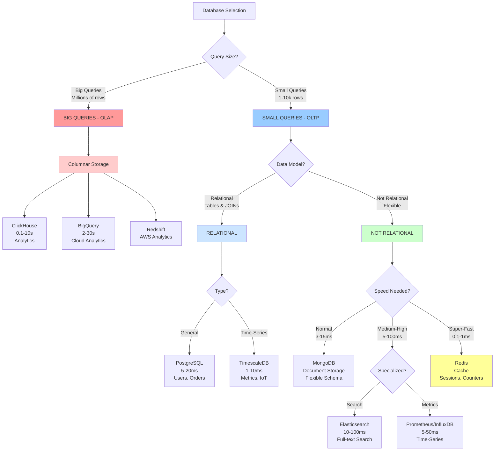
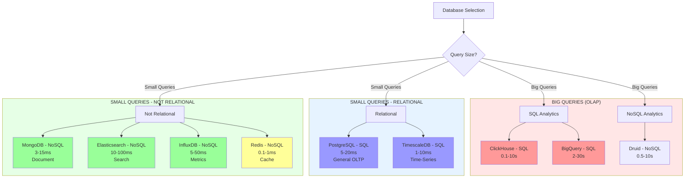
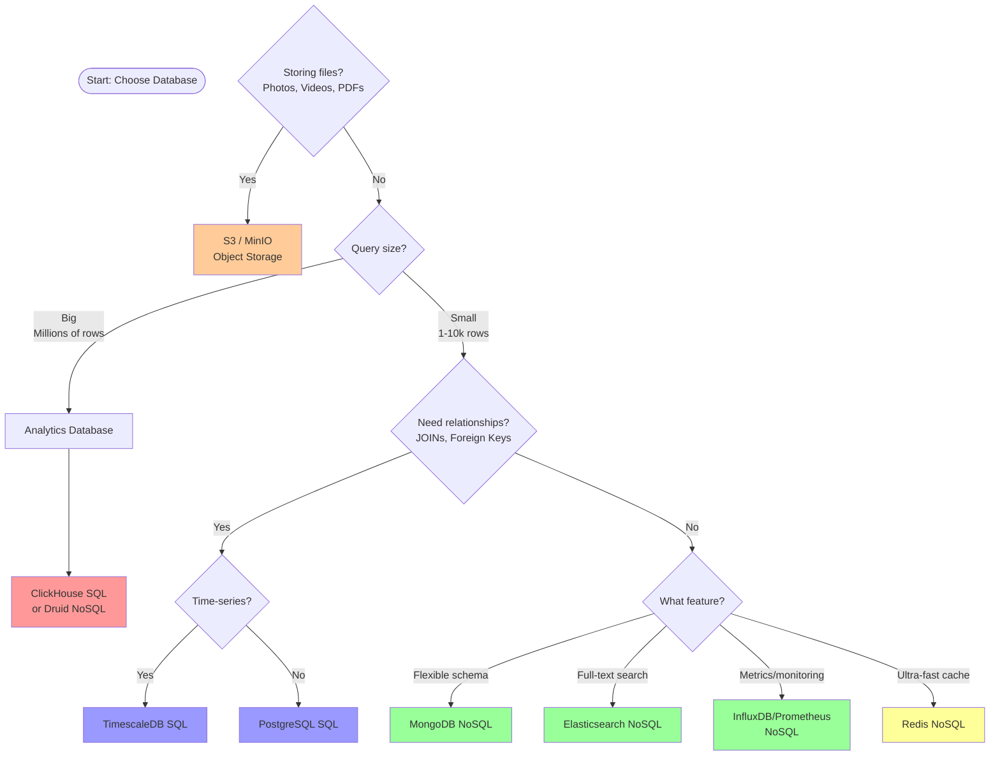

# Database Decision Matrix

**Author:** Diego Nepomuceno Marcos
**Updated:** 2025-12-14
**Purpose:** Complete guide for choosing the right database for your use case

---

## Table of Contents

1. [2D Matrix](#2d-matrix)
   - [Mermaid Diagram](#2d-mermaid-diagram)
   - [List Format](#2d-list-format)
   - [Table Format](#2d-table-format)
2. [3D Matrix](#3d-matrix)
   - [Mermaid Diagram](#3d-mermaid-diagram)
   - [List Format](#3d-list-format)
   - [Table Format](#3d-table-format)
   - [Matrix Format](#3d-matrix-format)
3. [Quick Decision Tree](#quick-decision-tree)

---

# 2D Matrix

## 2D Mermaid Diagram



## 2D List Format

### BIG QUERIES (OLAP)
**Purpose:** Aggregate millions/billions of rows for analytics, dashboards, reports

- **Columnar Databases**
  - **ClickHouse** - 0.1-10s per query (100M+ rows)
    - Analytics, dashboards, metrics
    - Excellent compression (10x better than OLTP)
  - **BigQuery** - 2-30s per query (billions of rows)
    - Google Cloud managed service
    - Serverless, auto-scaling
  - **Redshift** - Similar to BigQuery
    - AWS managed service
  - **Druid** - Real-time analytics
  - **Pinot** - LinkedIn's analytics DB

**Example Query:**
```sql
SELECT date_trunc('day', timestamp) as day,
       product_id,
       SUM(revenue) as total_revenue,
       COUNT(*) as orders
FROM sales
WHERE timestamp > '2024-01-01'
GROUP BY day, product_id
ORDER BY day DESC;
-- 100M rows → 0.3 seconds
```

---

### SMALL QUERIES (OLTP + Specialized)
**Purpose:** Individual record operations, small result sets (1-10,000 rows)

#### 1. RELATIONAL (Tables with relationships)

**A) General Purpose**
- **PostgreSQL** - 5-20ms per query
  - User accounts, orders, products
  - Complex JOINs, ACID transactions
  - Foreign keys, constraints
  - Example: `SELECT * FROM users u JOIN orders o ON u.id = o.user_id WHERE u.id = 123`

- **MySQL** - 5-20ms per query
  - Similar to PostgreSQL
  - Widely used, mature

**B) Time-Series Optimized**
- **TimescaleDB** - 1-10ms per query
  - PostgreSQL extension
  - Server metrics, IoT sensors
  - Automatic partitioning by time
  - Example: `SELECT time_bucket('5 minutes', time), AVG(cpu_percent) FROM metrics`

---

#### 2. NOT RELATIONAL (Flexible structures)

**A) Normal Speed - Document Storage**
- **MongoDB** - 3-15ms per query
  - Flexible schema (no migrations!)
  - Nested documents (JSON-like)
  - Single document operations
  - Example: `db.users.findOne({_id: 123})`
  - Use cases: CMS, user profiles, blog posts

**B) Medium-High Speed - Specialized**

**Search Optimized:**
- **Elasticsearch** - 10-100ms per query
  - Full-text search
  - Fuzzy matching, typo correction
  - Autocomplete, relevance scoring
  - Example: Search "wireless hedphones" → finds "Wireless Headphones"
  - Use cases: Product search, log analysis, autocomplete

- **Meilisearch** - Similar to Elasticsearch
  - Lightweight, easier to setup

- **Typesense** - Similar to Elasticsearch
  - Open source alternative

**Time-Series Optimized:**
- **InfluxDB** - 5-50ms per query
  - Real-time metrics, monitoring
  - Columnar storage
  - Custom query language (Flux)
  - Example: `from(bucket: "metrics") |> range(start: -1h) |> mean()`

- **Prometheus** - 5-50ms per query
  - Metrics + monitoring
  - Pull-based model
  - PromQL query language
  - Example: `rate(http_requests_total[5m])`

**C) Super-Fast - Cache/Key-Value**
- **Redis** - 0.1-1ms per query
  - In-memory storage
  - Sessions, cache, rate limiting
  - Counters, temporary data
  - Example: `GET user:123`, `SET session:abc "data"`
  - TTL/expiration support

- **Memcached** - 0.1-0.5ms per query
  - Simple cache (no persistence)

---

## 2D ASCII Art Matrix

### Query Type × Data Model

```
╔═══════════════════════════════════════════════════════════════════════════════════════════════════════════════════════╗
║                              D A T A B A S E   D E C I S I O N   M A T R I X                                          ║
╠══════════════════════════════════════════════════════════════════════════════════════════════════════════════════════ ╣
║                 ║ 🗃️ RELATIONAL      ║ 📄 DOCUMENT        ║ 🔑 KEY-VALUE     ║ 🔍 SEARCH          ║ ⏱️ TIME-SERIES    ║
╠═════════════════╬════════════════════╬════════════════════╬══════════════════╬════════════════════╬═══════════════════╣
║                 ║                    ║                    ║                  ║                    ║                   ║
║  ⚡ OLTP         ║  PostgreSQL (SQL)  ║  MongoDB (NoSQL)   ║  Redis (NoSQL)   ║ Elasticsearch(NoSQL)║ TimescaleDB (SQL)║
║                 ║  MySQL (SQL)       ║  CouchDB (NoSQL)   ║  Memcached(NoSQL)║  Meilisearch(NoSQL)║  InfluxDB (NoSQL) ║
║  Small queries  ║  MariaDB (SQL)     ║  DynamoDB (NoSQL)  ║  Valkey (NoSQL)  ║  Typesense (NoSQL) ║  Prometheus(NoSQL)║
║  1-10k rows     ║ ────────────────── ║ ────────────────── ║ ──────────────── ║ ────────────────── ║ ───────────────── ║
║  < 100ms        ║  5-20ms            ║  3-15ms            ║  0.1-1ms         ║  10-100ms          ║  1-50ms           ║
║                 ║                    ║                    ║                  ║                    ║                   ║
╠═════════════════╬════════════════════╬════════════════════╬══════════════════╬════════════════════╬═══════════════════╣
║                 ║                    ║                    ║                  ║                    ║                   ║
║  📊 OLAP        ║  ClickHouse (SQL)  ║                    ║                  ║                    ║                   ║
║                 ║  BigQuery (SQL)    ║    ❌ DON'T        ║    ❌ N/A        ║     ❌ DON'T       ║     ❌ DON'T      ║
║  Big queries    ║  Redshift (SQL)    ║                    ║                  ║                    ║                   ║
║  100M+ rows     ║ ────────────────── ║  Export to         ║  Not for         ║  Export to         ║   Export to       ║
║  0.1-30s        ║  0.1-30s           ║  ClickHouse!       ║  analytics       ║  ClickHouse!       ║  ClickHouse!      ║
║                 ║                    ║                    ║                  ║                    ║                   ║
╚═════════════════╩════════════════════╩════════════════════╩══════════════════╩════════════════════╩═══════════════════╝
```

---


### Markdown Table Version (Compact)

|                             | 🗃️ **RELATIONAL**                                       | 📄 **DOCUMENT**                                            | 🔑 **KEY-VALUE**                                         | 🔍 **SEARCH**                                                         | ⏱️ **TIME-SERIES**                                              |
| :-------------------------- | :------------------------------------------------------- | :--------------------------------------------------------- | :------------------------------------------------------- | :-------------------------------------------------------------------- | :-------------------------------------------------------------- |
| **⚡ OLTP**                  | PostgreSQL (SQL) <br> MySQL (SQL) <br> MariaDB (SQL)     | MongoDB (NoSQL) <br> CouchDB (NoSQL) <br> DynamoDB (NoSQL) | Redis (NoSQL) <br> Memcached (NoSQL) <br> Valkey (NoSQL) | Elasticsearch (NoSQL) <br> Meilisearch (NoSQL) <br> Typesense (NoSQL) | TimescaleDB (SQL) <br> InfluxDB (NoSQL) <br> Prometheus (NoSQL) |
| *Small queries, 1-10k rows* | **5-20ms**                                               | **3-15ms**                                                 | **0.1-1ms**                                              | **10-100ms**                                                          | **1-50ms**                                                      |
| **📊 OLAP**                 | ClickHouse (SQL) <br> BigQuery (SQL) <br> Redshift (SQL) | ❌ DON'T <br> *Export to ClickHouse!*                       | ❌ N/A <br> *Not for analytics*                           | ❌ DON'T <br> *Export to ClickHouse!*                                  | ❌ DON'T <br> *Export to ClickHouse!*                            |
| *Big queries, 100M+ rows*   | **0.1-30s**                                              | -                                                          | -                                                        | -                                                                     | -                                                               |

---

### Cell Details

#### ⚡ OLTP Row (Small Queries)

| Cell | Category | Databases | Latency | Use Cases |
|:----:|:---------|:----------|:-------:|:----------|
| **a0** | 🗃️ Relational | `PostgreSQL (SQL)` `MySQL (SQL)` `MariaDB (SQL)` | 5-20ms | User accounts, orders, JOINs, ACID |
| **a1** | 📄 Document | `MongoDB (NoSQL)` `CouchDB (NoSQL)` `DynamoDB (NoSQL)` | 3-15ms | Flexible schema, nested docs, CMS |
| **a2** | 🔑 Key-Value | `Redis (NoSQL)` `Memcached (NoSQL)` `Valkey (NoSQL)` | 0.1-1ms | Sessions, cache, counters, rate-limit |
| **a3** | 🔍 Search | `Elasticsearch (NoSQL)` `Meilisearch (NoSQL)` `Typesense (NoSQL)` | 10-100ms | Full-text search, logs, autocomplete |
| **a4** | ⏱️ Time-Series | `TimescaleDB (SQL)` `InfluxDB (NoSQL)` `Prometheus (NoSQL)` | 1-50ms | Metrics, monitoring, IoT sensors |

#### 📊 OLAP Row (Big Queries)

| Cell | Category | Databases | Latency | Use Cases |
|:----:|:---------|:----------|:-------:|:----------|
| **b0** | 🗃️ Columnar | `ClickHouse (SQL)` `BigQuery (SQL)` `Redshift (SQL)` | 0.1-30s | Analytics, dashboards, reports |
| **b1** | 📄 Document | ❌ Don't use | - | Export to ClickHouse instead |
| **b2** | 🔑 Key-Value | ❌ N/A | - | Not designed for analytics |
| **b3** | 🔍 Search | ❌ Don't use | - | Export to ClickHouse instead |
| **b4** | ⏱️ Time-Series | ❌ Don't use | - | Export to ClickHouse for historic |

---

### Quick Reference

```
┌─────────────────────────────────────────────────────────────────────┐
│  SPEED TIERS                                                        │
├─────────────────────────────────────────────────────────────────────┤
│  🟢 Ultra-fast   │  Redis, Memcached           │  0.1-1ms    │ KV   │
│  🟢 Fast         │  PostgreSQL, MongoDB        │  3-20ms     │ SQL  │
│  🟡 Medium       │  Elasticsearch, InfluxDB    │  10-100ms   │ NoSQL│
│  🔴 Slow (OLAP)  │  ClickHouse, BigQuery       │  0.1-30s    │ SQL  │
└─────────────────────────────────────────────────────────────────────┘

┌─────────────────────────────────────────────────────────────────────┐
│  DECISION FLOW                                                      │
├─────────────────────────────────────────────────────────────────────┤
│                                                                     │
│   Query Size?                                                       │
│   ├── BIG (100M+ rows) ──────────────► ClickHouse / BigQuery        │
│   └── SMALL (1-10k rows)                                            │
│       │                                                             │
│       └── What feature?                                             │
│           ├── Relationships/JOINs ───► PostgreSQL                   │
│           ├── Flexible schema ───────► MongoDB                      │
│           ├── Ultra-fast cache ──────► Redis                        │
│           ├── Full-text search ──────► Elasticsearch                │
│           └── Metrics/time-series ───► TimescaleDB / InfluxDB       │
│                                                                     │
└─────────────────────────────────────────────────────────────────────┘
```

---

## 2D Table Format

| Query Size | Data Model | Database | Latency | Use Cases | Key Features |
|------------|------------|----------|---------|-----------|--------------|
| **BIG QUERIES** | | | | | |
| OLAP | Columnar | ClickHouse | 0.1-10s | Analytics, Dashboards | 10x compression, columnar |
| OLAP | Columnar | BigQuery | 2-30s | Cloud Analytics | Serverless, auto-scale |
| OLAP | Columnar | Redshift | 2-30s | AWS Analytics | Managed service |
| **SMALL QUERIES** | | | | | |
| **Relational** | | | | | |
| OLTP | Relational (General) | PostgreSQL | 5-20ms | Users, Orders | ACID, JOINs, constraints |
| OLTP | Relational (General) | MySQL | 5-20ms | Web apps | Mature, widely used |
| OLTP | Relational (Time-Series) | TimescaleDB | 1-10ms | Metrics, IoT | PostgreSQL + time optimization |
| **Not Relational** | | | | | |
| OLTP | Document (Normal) | MongoDB | 3-15ms | CMS, Profiles | Flexible schema, nested docs |
| OLTP | Document (Search) | Elasticsearch | 10-100ms | Search, Logs | Full-text, fuzzy matching |
| OLTP | Columnar (Metrics) | InfluxDB | 5-50ms | Monitoring | Real-time metrics |
| OLTP | Columnar (Metrics) | Prometheus | 5-50ms | Monitoring | Pull-based, PromQL |
| OLTP | Key-Value (Cache) | Redis | 0.1-1ms | Sessions, Cache | In-memory, super fast |
| OLTP | Key-Value (Cache) | Memcached | 0.1-0.5ms | Simple cache | No persistence |

---

# 3D Matrix

## 3D Mermaid Diagram



## 3D List Format

### Dimension 1: Query Size
- Big Queries (OLAP)
- Small Queries (OLTP + Specialized)

### Dimension 2: Data Model
- Relational
- Document
- Key-Value
- Columnar

### Dimension 3: Query Language
- SQL
- NoSQL

---

### The Complete 3D Space

#### BIG QUERIES (OLAP)
**SQL Databases (80% of market):**
- **ClickHouse**
  - Query Language: SQL
  - Latency: 0.1-10s
  - Use Case: Analytics, dashboards, reports
  - Storage: Columnar

- **BigQuery** (Google Cloud)
  - Query Language: SQL
  - Latency: 2-30s
  - Use Case: Cloud analytics, data warehouse
  - Storage: Columnar

- **Redshift** (AWS)
  - Query Language: SQL
  - Latency: 2-30s
  - Use Case: AWS analytics
  - Storage: Columnar

**NoSQL Databases (20% of market):**
- **Apache Druid**
  - Query Language: JSON API
  - Latency: 0.5-10s
  - Use Case: Real-time analytics
  - Storage: Columnar

- **Apache Pinot**
  - Query Language: SQL-like + JSON
  - Latency: 0.5-10s
  - Use Case: LinkedIn-scale analytics
  - Storage: Columnar

---

#### SMALL QUERIES - RELATIONAL

**SQL Databases (95% of market):**
- **PostgreSQL** (General Purpose)
  - Query Language: SQL
  - Latency: 5-20ms
  - Use Case: User accounts, orders, products
  - Storage: Row-based (relational)
  - Features: ACID, JOINs, foreign keys, constraints

- **MySQL** (General Purpose)
  - Query Language: SQL
  - Latency: 5-20ms
  - Use Case: Web applications
  - Storage: Row-based (relational)

- **TimescaleDB** (Time-Series)
  - Query Language: SQL (PostgreSQL extension)
  - Latency: 1-10ms
  - Use Case: Server metrics, IoT sensors
  - Storage: Hybrid (relational + time-optimized)

**NoSQL Databases (5% of market):**
- **CockroachDB**
  - Query Language: SQL (distributed SQL)
  - Latency: 10-50ms
  - Use Case: Distributed transactions
  - Storage: Distributed relational

---

#### SMALL QUERIES - NOT RELATIONAL

**NoSQL Databases (90% of market):**

**Normal Speed - Document:**
- **MongoDB**
  - Query Language: MongoDB Query Language (NoSQL)
  - Latency: 3-15ms
  - Use Case: CMS, user profiles, flexible schema
  - Storage: Document (BSON)
  - Features: Flexible schema, nested documents, sharding

- **CouchDB**
  - Query Language: Mango/CouchDB Query (NoSQL)
  - Latency: 5-20ms
  - Use Case: Offline-first apps
  - Storage: Document (JSON)

**Medium-High Speed - Search:**
- **Elasticsearch**
  - Query Language: JSON DSL (NoSQL)
  - Latency: 10-100ms
  - Use Case: Full-text search, logs, autocomplete
  - Storage: Document (inverted indexes)
  - Features: Fuzzy search, typo correction, relevance scoring

- **Meilisearch**
  - Query Language: REST API (NoSQL)
  - Latency: 5-50ms
  - Use Case: Fast search, autocomplete
  - Storage: Document

**Medium-High Speed - Time-Series/Metrics:**
- **InfluxDB**
  - Query Language: Flux/InfluxQL (NoSQL)
  - Latency: 5-50ms
  - Use Case: Real-time metrics, monitoring
  - Storage: Columnar (time-optimized)

- **Prometheus**
  - Query Language: PromQL (NoSQL)
  - Latency: 10-100ms
  - Use Case: Metrics, monitoring, alerting
  - Storage: Columnar (time-series)

**Super-Fast - Cache:**
- **Redis**
  - Query Language: Redis Commands (NoSQL)
  - Latency: 0.1-1ms
  - Use Case: Sessions, cache, rate limiting, counters
  - Storage: Key-Value (in-memory)
  - Features: TTL, pub/sub, data structures (lists, sets, hashes)

- **Memcached**
  - Query Language: Memcached Protocol (NoSQL)
  - Latency: 0.1-0.5ms
  - Use Case: Simple cache
  - Storage: Key-Value (in-memory, no persistence)

**SQL Databases (10% of market):**
- Rare exceptions (some document stores support SQL-like queries)

---

## 3D Table Format

| Query Size | Data Model | Database | SQL/NoSQL | Latency | Primary Use Case | Market Share |
|------------|------------|----------|-----------|---------|------------------|--------------|
| **BIG QUERIES (OLAP)** | | | | | | |
| Big | Columnar | ClickHouse | SQL ✓ | 0.1-10s | Analytics, Dashboards | 40% |
| Big | Columnar | BigQuery | SQL ✓ | 2-30s | Cloud Analytics | 25% |
| Big | Columnar | Redshift | SQL ✓ | 2-30s | AWS Analytics | 15% |
| Big | Columnar | Druid | NoSQL | 0.5-10s | Real-time Analytics | 10% |
| Big | Columnar | Pinot | NoSQL | 0.5-10s | LinkedIn Analytics | 5% |
| **SMALL QUERIES - RELATIONAL** | | | | | | |
| Small | Relational | PostgreSQL | SQL ✓ | 5-20ms | Users, Orders, OLTP | 50% |
| Small | Relational | MySQL | SQL ✓ | 5-20ms | Web Apps | 35% |
| Small | Relational | TimescaleDB | SQL ✓ | 1-10ms | Metrics, IoT | 10% |
| Small | Relational | CockroachDB | SQL ✓ | 10-50ms | Distributed ACID | 5% |
| **SMALL QUERIES - NOT RELATIONAL** | | | | | | |
| Small | Document | MongoDB | NoSQL | 3-15ms | Flexible Schema, CMS | 60% |
| Small | Document | CouchDB | NoSQL | 5-20ms | Offline-first | 5% |
| Small | Document | Elasticsearch | NoSQL | 10-100ms | Search, Logs | 20% |
| Small | Document | Meilisearch | NoSQL | 5-50ms | Fast Search | 2% |
| Small | Columnar | InfluxDB | NoSQL | 5-50ms | Metrics, Monitoring | 8% |
| Small | Columnar | Prometheus | NoSQL | 10-100ms | Monitoring, Alerts | 15% |
| Small | Key-Value | Redis | NoSQL | 0.1-1ms | Cache, Sessions | 80% |
| Small | Key-Value | Memcached | NoSQL | 0.1-0.5ms | Simple Cache | 20% |

---

## 3D Matrix Format

### Matrix View: Query Size × Data Model × SQL/NoSQL

```
LAYER 1: BIG QUERIES (OLAP)
═══════════════════════════════════════════════════════════════
                    SQL                     NoSQL
Columnar    ┌──────────────────────┐  ┌──────────────────────┐
            │ ClickHouse (0.1-10s) │  │ Druid (0.5-10s)      │
            │ BigQuery (2-30s)     │  │ Pinot (0.5-10s)      │
            │ Redshift (2-30s)     │  │                      │
            └──────────────────────┘  └──────────────────────┘

═══════════════════════════════════════════════════════════════
LAYER 2: SMALL QUERIES - RELATIONAL
═══════════════════════════════════════════════════════════════
                    SQL                     NoSQL
Relational  ┌──────────────────────┐  ┌──────────────────────┐
(General)   │ PostgreSQL (5-20ms)  │  │ (Rare)               │
            │ MySQL (5-20ms)       │  │ CockroachDB          │
            │                      │  │ (10-50ms)            │
            └──────────────────────┘  └──────────────────────┘

Relational  ┌──────────────────────┐  ┌──────────────────────┐
(Time-      │ TimescaleDB (1-10ms) │  │ (None common)        │
Series)     │                      │  │                      │
            └──────────────────────┘  └──────────────────────┘

═══════════════════════════════════════════════════════════════
LAYER 3: SMALL QUERIES - NOT RELATIONAL
═══════════════════════════════════════════════════════════════
                    SQL                     NoSQL
Document    ┌──────────────────────┐  ┌──────────────────────┐
(Normal)    │ (Rare)               │  │ MongoDB (3-15ms)     │
            │                      │  │ CouchDB (5-20ms)     │
            │                      │  │ DynamoDB (5-20ms)    │
            └──────────────────────┘  └──────────────────────┘

Document    ┌──────────────────────┐  ┌──────────────────────┐
(Search)    │ (None)               │  │ Elasticsearch        │
            │                      │  │ (10-100ms)           │
            │                      │  │ Meilisearch (5-50ms) │
            └──────────────────────┘  └──────────────────────┘

Columnar    ┌──────────────────────┐  ┌──────────────────────┐
(Metrics)   │ (None)               │  │ InfluxDB (5-50ms)    │
            │                      │  │ Prometheus (10-100ms)│
            └──────────────────────┘  └──────────────────────┘

Key-Value   ┌──────────────────────┐  ┌──────────────────────┐
(Cache)     │ (None)               │  │ Redis (0.1-1ms)      │
            │                      │  │ Memcached (0.1-0.5ms)│
            └──────────────────────┘  └──────────────────────┘
```

---

## Quick Decision Tree



---

## Speed Comparison Chart

```
DATABASE          QUERY TYPE              LATENCY       SQL/NoSQL
═══════════════════════════════════════════════════════════════════
Redis             GET key                 0.1ms         NoSQL ████
Memcached         GET key                 0.2ms         NoSQL ████
───────────────────────────────────────────────────────────────────
TimescaleDB       Time aggregate          1-10ms        SQL   ████
MongoDB           findOne({id})           3-15ms        NoSQL ████
PostgreSQL        SELECT WHERE id         5-20ms        SQL   ████
MySQL             SELECT WHERE id         5-20ms        SQL   ████
InfluxDB          Metrics query           5-50ms        NoSQL ████
───────────────────────────────────────────────────────────────────
Elasticsearch     Full-text search        10-100ms      NoSQL ████
Prometheus        Metrics aggregate       10-100ms      NoSQL ████
───────────────────────────────────────────────────────────────────
ClickHouse        100M row aggregate      0.1-10s       SQL   ████
BigQuery          1B row aggregate        2-30s         SQL   ████
```

---

## Key Patterns

### 1. SQL Dominates Big Queries
- **80%** of OLAP databases use SQL
- ClickHouse, BigQuery, Redshift all use SQL
- Why: Complex aggregations are easier with SQL

### 2. SQL Dominates Relational Data
- **95%** of relational databases use SQL
- PostgreSQL, MySQL standard for OLTP
- Why: SQL was designed for relational data

### 3. NoSQL Dominates Specialized Use Cases
- **90%** of search, cache, document stores are NoSQL
- MongoDB, Redis, Elasticsearch all NoSQL
- Why: Each has optimized query language for their use case

### 4. Speed Hierarchy (Small Queries)
```
Super-Fast:   Redis (0.1ms)        - NoSQL
Fast:         PostgreSQL (5-20ms)  - SQL
Medium:       Elasticsearch (50ms) - NoSQL
```

### 5. The Polyglot Persistence Pattern
Modern applications use MULTIPLE databases:

```
Application
├── PostgreSQL (SQL)     - User accounts, orders
├── Redis (NoSQL)        - Sessions, cache
├── MongoDB (NoSQL)      - CMS content
├── Elasticsearch (NoSQL) - Product search
├── ClickHouse (SQL)     - Analytics
└── S3/MinIO             - Files (images, videos)
```

---

## Conclusion

**The matrix is 3-dimensional:**
1. **Query Size**: Big (OLAP) vs Small (OLTP)
2. **Data Model**: Relational, Document, Key-Value, Columnar
3. **Query Language**: SQL vs NoSQL

**Key insight:** Use the right tool for each job. Don't force one database to do everything!

**Most common stack:**
- PostgreSQL (SQL) - Primary database
- Redis (NoSQL) - Cache
- S3/MinIO - Files

**Add as needed:**
- ClickHouse (SQL) - Analytics
- Elasticsearch (NoSQL) - Search
- MongoDB (NoSQL) - Flexible schema
- TimescaleDB (SQL) - Time-series
