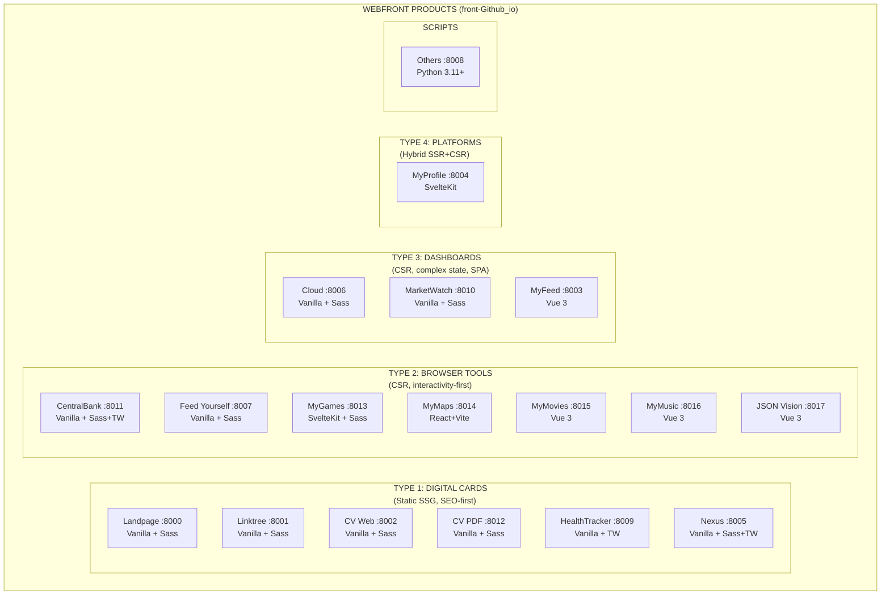
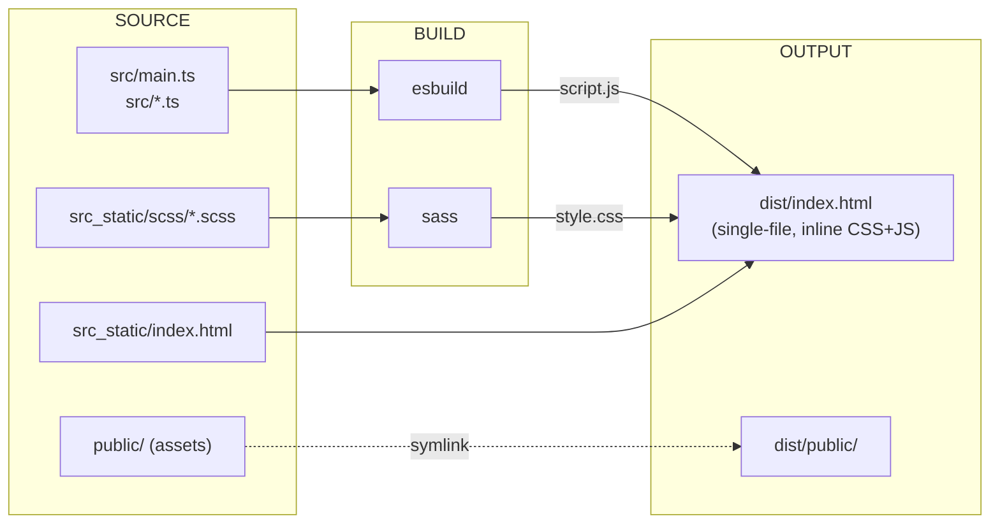
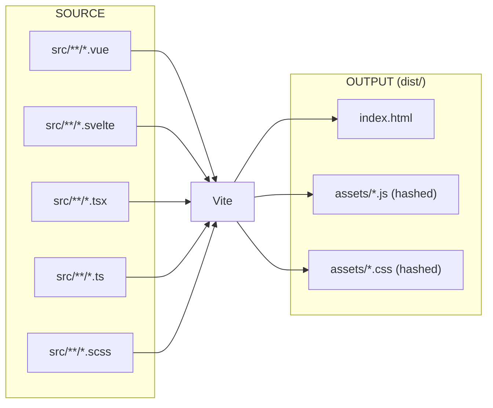
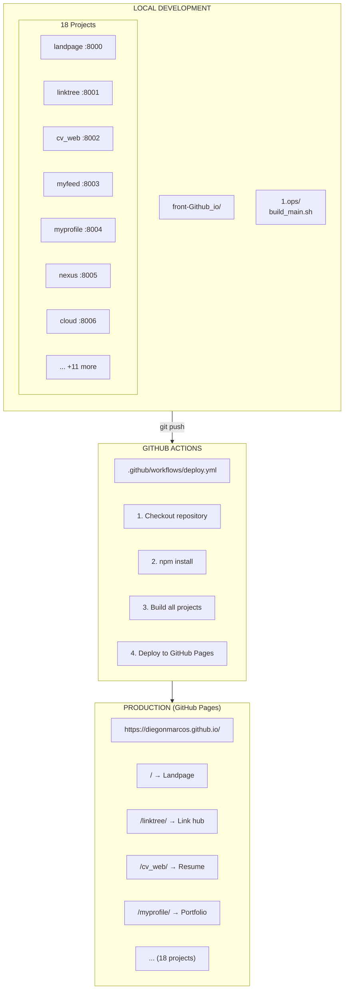
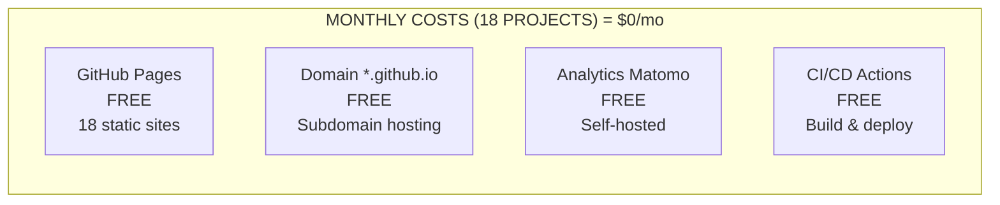

# Webfront Master Plan

**Project:** Diego's Front-End Portfolio & Web Applications
**Parent:** `MASTERPLAN_CLOUD.md` → A0) Products → User Profile/Portfolio
**Repo:** `/home/diego/Documents/Git/front-Github_io/`
**CTO:** Claude (Opus)
**Date:** 2025-12-11
**Status:** ON (Production)

---

## Executive Summary

> [!abstract] A) HANDOFF - WHAT we're building (18 Web Applications)
> - **[[#A0) Products]]** - 18 web applications & pages
>   - Type 1: Digital Cards - Landpage, Linktree, CV Web, CV PDF, HealthTracker, Nexus
>   - Type 2: Browser Tools - CentralBank, MyGames, MyMaps, MyMovies, MyMusic, JSON Vision, Feed Yourself
>   - Type 3: Dashboards - Cloud, MarketWatch, MyFeed
>   - Type 4: Platforms - MyProfile
> - **[[#A1) Infra Services]]** - Build systems, dev servers, analytics
> - **[[#A2) Infra Resources]]** - GitHub Pages (free), dev ports 8000-8017

> [!note] X) APPENDIX - Reference Material
> - **[[#X0) Code Practices]]** - TypeScript, Svelte 5, Vue 3, SCSS standards
> - **[[#X1) System OS Practices]]** - Poetry, Flatpak, Nix, dotfiles
> - **[[#X2) Tech Research]]** - Framework decisions per project type
> - **[[#X3) Current State]]** - Current status & quick ref

> [!info] D) DEVOPS - HOW we build & deploy
> - **[[#D0) Build System]]** - build_main.sh orchestrator, per-project scripts
> - **[[#D1) CI/CD Pipeline]]** - GitHub Actions → GitHub Pages
> - **[[#D2) Analytics (Matomo)]]** - MTM container, event tracking, integration status
> - **[[#D3) Folder Structure]]** - Vanilla/Vue/Svelte project templates
> - **[[#D4) Dependencies]]** - Node.js, npm, Python, Sass
> - **[[#D5) Troubleshooting]]** - Common issues & solutions
> - **[[#D6) Security Vault (LOCAL_KEYS)]]** - SSH access, credentials, Bitwarden
> - **[[#D7) Code Practices]]** - HTML/a11y, SCSS mixins, TS rules, SPA analytics

**Connection to MASTERPLAN_CLOUD:**
```
MASTERPLAN_CLOUD.md
└── A0) Products (FRIDGE)
    └── User Profile/Portfolio
        └── front-Github_io → THIS DOCUMENT (18 projects)
```

---

# A) HANDOFF - Webfront Definition

## A0) Products

### Product Overview



---

### Type 1: Digital Business Cards

> **Static SSG, SEO-first, minimal JS. Pre-built HTML, no server needed.**

```
Name                     | Component            | Stack               | Purpose
─────────────────────────┼──────────────────────┼─────────────────────┼────────────────────────────────
landpage                 | -                    | -                   | Main Landing & Entry Point
  ↳ landpage-front       | Landing UI           | Vanilla + Sass + TS | Hero, navigation, intro
  ↳ landpage-build       | Build Pipeline       | Sass + esbuild      | SCSS → CSS, TS → JS
  ↳ landpage-host        | Static Host          | GitHub Pages        | diegonmarcos.github.io/
                         |                      |                     |
linktree                 | -                    | -                   | Personal Link Hub & Bio
  ↳ linktree-front       | Link Hub UI          | Vanilla + Sass + TS | Glassmorphic cards, carousels
  ↳ linktree-build       | Build Pipeline       | Sass + esbuild      | Single-file HTML output
  ↳ linktree-host        | Static Host          | GitHub Pages        | /linktree/
                         |                      |                     |
cv_web                   | -                    | -                   | Digital Resume/CV
  ↳ cv_web-front         | Resume UI            | Vanilla + Sass + TS | Interactive CV sections
  ↳ cv_web-build         | Build Pipeline       | Sass + esbuild      | SCSS → CSS, TS → JS
  ↳ cv_web-host          | Static Host          | GitHub Pages        | /cv_web/
                         |                      |                     |
cv_pdf                   | -                    | -                   | PDF Resume Generator
  ↳ cv_pdf-front         | PDF Preview UI       | Vanilla + Sass + TS | Print-optimized layout
  ↳ cv_pdf-build         | Build Pipeline       | Sass + esbuild      | SCSS → CSS, TS → JS
  ↳ cv_pdf-host          | Static Host          | GitHub Pages        | /cv_pdf/
                         |                      |                     |
healthtracker            | -                    | -                   | Personal Health Monitoring
  ↳ healthtracker-front  | Health UI            | Vanilla + Tailwind  | Health metrics display
  ↳ healthtracker-host   | Static Host          | GitHub Pages        | /healthtracker/
                         |                      |                     |
nexus                    | -                    | -                   | Company Business Website
  ↳ nexus-front          | Business UI          | Vanilla + Sass+TW   | Corporate presentation
  ↳ nexus-build          | Build Pipeline       | Sass + esbuild      | SCSS → CSS, TS → JS
  ↳ nexus-host           | Static Host          | GitHub Pages        | /nexus/
```

---

### Type 2: Browser Tools

> **CSR (Client-Side Rendering). Fast DOM manipulation, interactivity-first. SEO secondary.**

```
Name                     | Component            | Stack               | Purpose
─────────────────────────┼──────────────────────┼─────────────────────┼────────────────────────────────
central_bank             | -                    | -                   | Central Bank Modeling Tool
  ↳ central_bank-front   | Simulation UI        | Vanilla + Sass+TW   | Interactive economic models
  ↳ central_bank-build   | Build Pipeline       | Vite                | HMR, fast bundling
  ↳ central_bank-host    | Static Host          | GitHub Pages        | /central_bank/
                         |                      |                     |
feed_yourself            | -                    | -                   | Calculator / Utility Tool
  ↳ feed_yourself-front  | Calculator UI        | Vanilla + Sass + TS | Nutrition calculations
  ↳ feed_yourself-build  | Build Pipeline       | Sass + esbuild      | SCSS → CSS, TS → JS
  ↳ feed_yourself-host   | Static Host          | GitHub Pages        | /feed_yourself/
                         |                      |                     |
mygames                  | -                    | -                   | Retro Games Collection
  ↳ mygames-front        | Games UI             | SvelteKit + Sass    | Game emulators, saves
  ↳ mygames-build        | Build Pipeline       | Vite + SvelteKit    | SSR/Hydration
  ↳ mygames-host         | Static Host          | GitHub Pages        | /mygames/
                         |                      |                     |
mymaps                   | -                    | -                   | Strategic Map Viewer
  ↳ mymaps-front         | Maps UI              | React+Vite + Sass   | Interactive maps
  ↳ mymaps-build         | Build Pipeline       | Vite                | HMR, fast bundling
  ↳ mymaps-host          | Static Host          | GitHub Pages        | /mymaps/
                         |                      |                     |
mymovies                 | -                    | -                   | Movie & TV Series Browser
  ↳ mymovies-front       | Media UI             | Vue 3 + Sass + TS   | Movie database browser
  ↳ mymovies-build       | Build Pipeline       | Vite                | HMR, fast bundling
  ↳ mymovies-host        | Static Host          | GitHub Pages        | /mymovies/
                         |                      |                     |
mymusic                  | -                    | -                   | Winamp-Style Music Library
  ↳ mymusic-front        | Music Player UI      | Vue 3 + Sass + TS   | Retro music player
  ↳ mymusic-build        | Build Pipeline       | Vite                | HMR, fast bundling
  ↳ mymusic-host         | Static Host          | GitHub Pages        | /mymusic/
                         |                      |                     |
json_vision              | -                    | -                   | Visual JSON Editor & Graph
  ↳ json_vision-front    | Editor UI            | Vue 3 + Sass + TS   | JSON visualization
  ↳ json_vision-build    | Build Pipeline       | Vite                | HMR, fast bundling
  ↳ json_vision-host     | Static Host          | GitHub Pages        | /json_vision/
```

---

### Type 3: Private Dashboards

> **CSR (Client-Side Rendering). Complex state management. SPA architecture.**

```
Name                     | Component            | Stack               | Purpose
─────────────────────────┼──────────────────────┼─────────────────────┼────────────────────────────────
cloud                    | -                    | -                   | Cloud Resources Monitor
  ↳ cloud-front          | Dashboard UI         | Vanilla + Sass + TS | VM status, services
  ↳ cloud-build          | Build Pipeline       | Sass + esbuild      | SCSS → CSS, TS → JS
  ↳ cloud-host           | Static Host          | GitHub Pages        | /cloud/
                         |                      |                     |
marketwatch              | -                    | -                   | Financial Market Tracker
  ↳ marketwatch-front    | Markets UI           | Vanilla + Sass + TS | Stock charts, portfolios
  ↳ marketwatch-build    | Build Pipeline       | Sass + esbuild      | SCSS → CSS, TS → JS
  ↳ marketwatch-host     | Static Host          | GitHub Pages        | /marketwatch/
                         |                      |                     |
myfeed                   | -                    | -                   | Social Feed Aggregator
  ↳ myfeed-front         | Feed UI              | Vue 3 + Sass + TS   | Multi-platform feed
  ↳ myfeed-build         | Build Pipeline       | Vite                | HMR, fast bundling
  ↳ myfeed-host          | Static Host          | GitHub Pages        | /myfeed/
```

---

### Type 4: Public Platforms

> **Hybrid (SSR + Hydration). SEO of Type 1 + interactivity of Type 3.**

```
Name                     | Component            | Stack               | Purpose
─────────────────────────┼──────────────────────┼─────────────────────┼────────────────────────────────
myprofile                | -                    | -                   | Personal Portfolio Showcase
  ↳ myprofile-front      | Portfolio UI         | SvelteKit + Sass    | Projects, skills, experience
  ↳ myprofile-build      | Build Pipeline       | Vite + SvelteKit    | SSR/Hydration
  ↳ myprofile-host       | Static Host          | GitHub Pages        | /myprofile/
```

---

### Scripts & Tools

```
Name                     | Component            | Stack               | Purpose
─────────────────────────┼──────────────────────┼─────────────────────┼────────────────────────────────
others                   | -                    | -                   | Python Tools & Scripts
  ↳ others-scripts       | Utility Scripts      | Python 3.11+        | Various automation tools
  ↳ others-host          | Static Host          | GitHub Pages        | /others/
```

---

### Linktree Sections (Hub Navigation)

The **linktree** project serves as the central hub linking to all other projects:

| Section | Projects Linked |
|---------|-----------------|
| **Professional** | CV Web, CV PDF, LinkedIn, GitHub |
| **Portfolio** | MyProfile, Nexus |
| **Tools** | Cloud, MarketWatch, HealthTracker, CentralBank, Feed Yourself |
| **Entertainment** | MyGames, MyMusic, MyMovies, MyMaps |
| **Dev Tools** | JSON Vision, MyFeed |

---

## A1) Infra Services

### Tech Definition

```
Name                     | Component            | Stack               | Purpose
─────────────────────────┼──────────────────────┼─────────────────────┼────────────────────────────────
; BUILD SYSTEMS
sass                     | CSS Compiler         | Sass (npm)          | SCSS → CSS compilation
esbuild                  | JS Bundler           | esbuild             | TypeScript → JS bundling (Vanilla)
vite                     | Dev/Build Tool       | Vite                | HMR + bundling (Vue/React/Svelte)
sveltekit                | Framework            | SvelteKit + Vite    | SSR/Hydration for Type 4
build.sh                 | Orchestrator         | Shell script        | Per-project build scripts
build_main.sh            | Master Orchestrator  | Shell script        | Multi-project builds
                         |                      |                     |
; DEV SERVERS
live-server              | Static Dev Server    | npm live-server     | Vanilla projects (Type 1)
vite-dev                 | HMR Dev Server       | Vite                | Vue/React/Svelte (Type 2-4)
                         |                      |                     |
; ANALYTICS
matomo                   | Analytics            | Matomo Tag Manager  | Cookie-less tracking (all projects)
```

### Dev Server Ports

```
Port  | Project       | Framework   | Server Type
──────┼───────────────┼─────────────┼────────────────────────────────
:8000 | Landpage      | Vanilla     | live-server
:8001 | Linktree      | Vanilla     | live-server
:8002 | CV Web        | Vanilla     | live-server
:8003 | MyFeed        | Vue 3       | Vite HMR
:8004 | MyProfile     | SvelteKit   | Vite HMR
:8005 | Nexus         | Vanilla     | live-server
:8006 | Cloud         | Vanilla     | live-server
:8007 | Feed Yourself | Vanilla     | live-server
:8008 | Others        | Python      | live-server
:8009 | HealthTracker | Vanilla     | live-server
:8010 | MarketWatch   | Vanilla     | live-server
:8011 | CentralBank   | Vanilla     | Vite HMR
:8012 | CV PDF        | Vanilla     | live-server
:8013 | MyGames       | SvelteKit   | Vite HMR
:8014 | MyMaps        | React+Vite  | Vite HMR
:8015 | MyMovies      | Vue 3       | Vite HMR
:8016 | MyMusic       | Vue 3       | Vite HMR
:8017 | JSON Vision   | Vue 3       | Vite HMR
```

### Build Pipelines

**Vanilla Projects (Sass + esbuild):**

> Projects: Landpage, Linktree, CV Web, CV PDF, Nexus, Cloud, MarketWatch, Feed Yourself, HealthTracker

**Vite Projects (Vue/React/Svelte):**

> Projects: MyFeed, MyProfile, MyGames, MyMaps, MyMovies, MyMusic, JSON Vision, CentralBank

### SCSS Structure (ITCSS)

```
scss/
├── abstracts/           # Variables, mixins, functions (no CSS output)
│   ├── _variables.scss
│   ├── _mixins.scss
│   └── _functions.scss
├── base/                # Foundation styles
│   ├── _reset.scss
│   └── _typography.scss
├── components/          # Reusable UI elements
│   ├── _buttons.scss
│   ├── _cards.scss
│   └── _carousel.scss
├── layout/              # Major structural components
│   ├── _header.scss
│   └── _sections.scss
├── themes/              # Theme variations
│   └── _glassmorphic.scss
├── utilities/           # Helpers, animations
│   └── _animations.scss
└── main.scss            # Master import file
```

---

## A2) Infra Resources

### A20) Resource Allocation

#### A200) Resource Estimation

```
Resource                  | Type          | Allocation     | Notes
──────────────────────────┼───────────────┼────────────────┼─────────────────────────────
GitHub Pages              | Static Host   | Unlimited      | Free tier (all 18 projects)
Cloudflare CDN            | CDN           | Unlimited      | Free tier (if enabled)
Matomo Analytics          | Analytics     | Shared         | Self-hosted on oci-f-micro_2
```

#### A201) Project URLs

```
Project       | Production URL                                    | Dev Port
──────────────┼───────────────────────────────────────────────────┼──────────
Landpage      | https://diegonmarcos.github.io/                   | :8000
Linktree      | https://diegonmarcos.github.io/linktree/          | :8001
CV Web        | https://diegonmarcos.github.io/cv_web/            | :8002
CV PDF        | https://diegonmarcos.github.io/cv_pdf/            | :8012
HealthTracker | https://diegonmarcos.github.io/healthtracker/     | :8009
Nexus         | https://diegonmarcos.github.io/nexus/             | :8005
CentralBank   | https://diegonmarcos.github.io/central_bank/      | :8011
Feed Yourself | https://diegonmarcos.github.io/feed_yourself/     | :8007
MyGames       | https://diegonmarcos.github.io/mygames/           | :8013
MyMaps        | https://diegonmarcos.github.io/mymaps/            | :8014
MyMovies      | https://diegonmarcos.github.io/mymovies/          | :8015
MyMusic       | https://diegonmarcos.github.io/mymusic/           | :8016
JSON Vision   | https://diegonmarcos.github.io/json_vision/       | :8017
Cloud         | https://diegonmarcos.github.io/cloud/             | :8006
MarketWatch   | https://diegonmarcos.github.io/marketwatch/       | :8010
MyFeed        | https://diegonmarcos.github.io/myfeed/            | :8003
MyProfile     | https://diegonmarcos.github.io/myprofile/         | :8004
Others        | https://diegonmarcos.github.io/others/            | :8008
```

#### A202) Cost Estimation

```
Item                   | Provider      | Monthly Cost  | Notes
───────────────────────┼───────────────┼───────────────┼─────────────────────────────
GitHub Pages           | GitHub        | $0            | Free static hosting (18 projects)
Domain                 | GitHub        | $0            | diegonmarcos.github.io/*
Matomo Analytics       | Self-hosted   | $0            | Shared with cloud projects
───────────────────────┼───────────────┼───────────────┼─────────────────────────────
TOTAL                  |               | $0/mo         |
```

---

### A21) Maps & Topology



---

### A22) Costs



---

## X0) Code Practices

> **Source:** `/front-Github_io/1.ops/30_Code_Practise.md`

### X00) Tech Stack & Environment

- **Framework:** SvelteKit (Svelte 5 Runes Mode) / Vue 3 (Composition API)
- **Language:** TypeScript (Strict Mode)
- **Styling:** SCSS (Sass) with "Golden Mixins"
- **Analytics:** Matomo (Self-Hosted) via custom component
- **Rendering:** Hybrid (SSR + SPA Client-Side Navigation)

### X01) Svelte 5 & TypeScript Rules

**CRITICAL:** Do NOT use Svelte 4 syntax.

```
Props     → let { propName }: { propName: Type } = $props();   // NEVER use export let
State     → let count = $state(0);                              // NEVER use let var = val
Computed  → let doubled = $derived(count * 2);                  // NEVER use $: var = val
Effects   → $effect(() => { ... });                             // NEVER use onMount for reactive
Events    → onclick, oninput                                    // NEVER use on:click
```

**Typing:**
- Always import `PageData` and `PageServerLoad` from `./$types`
- Use `HTMLInputElement`, `HTMLButtonElement`, etc., for DOM refs

### X02) Vue 3 Rules

**Always use Composition API with `<script setup lang="ts">`**

```typescript
// Props - use generic type syntax
defineProps<{ id: number; name: string }>()

// Refs - explicit types for nullable
const user = ref<User | null>(null)

// Emits - typed
defineEmits<{ (e: 'update', id: number): void }>()
```

### X03) HTML & Accessibility

**Goal:** Semantic, accessible, and clean HTML.

- **No Div Soup:**
  - ❌ `div class="nav"` → ✅ `<nav>`
  - ❌ `div class="card"` → ✅ `<article class="card">`
  - ❌ `div class="footer"` → ✅ `<footer>`
- **Buttons vs Links:**
  - Use `<a href="...">` ONLY for navigation (changing URLs)
  - Use `<button type="button">` for actions (toggles, modals, API calls)
- **Forms:** Every `<input>` must have a linked `<label>` (via `for` attribute or wrapping)
- **Images:** All `` tags MUST have an `alt` attribute

### X04) SCSS & Styling Rules (Golden Mixins)

**Goal:** Consistent, mobile-first responsive design.

**Global Logic:**
- Use **Flexbox** or **Grid** for all layouts
- **FORBIDDEN:** `float`, `clear`, or `position: absolute` (unless for UI overlays)
- Use `rem` for spacing/fonts, `%` for widths

**The Golden Mixins:**
```scss
// Breakpoints (Mobile-first)
$breakpoints: ('sm': 480px, 'md': 768px, 'lg': 1024px, 'xl': 1280px);
@mixin mq($size) {
  @media (min-width: map-get($breakpoints, $size)) { @content; }
}

// Flexbox
@mixin flex-center { display: flex; justify-content: center; align-items: center; }
@mixin flex-row($justify: flex-start, $align: stretch, $gap: 0) {
  display: flex; flex-direction: row; justify-content: $justify;
  align-items: $align; gap: $gap; flex-wrap: wrap;
}
@mixin flex-col($justify: flex-start, $align: stretch, $gap: 0) {
  display: flex; flex-direction: column; justify-content: $justify;
  align-items: $align; gap: $gap;
}

// CSS Grid
@mixin grid-auto-fit($min-size: 250px, $gap: 1rem) {
  display: grid; grid-template-columns: repeat(auto-fit, minmax($min-size, 1fr)); gap: $gap;
}
```

### X05) TypeScript Rules (Vanilla)

**Strict Null Checks for DOM:**
```typescript
// ❌ Bad - Object is possibly null
document.querySelector('.btn').addEventListener(...)

// ✅ Good - Check null, cast type
const btn = document.querySelector('.btn') as HTMLButtonElement;
if (btn) { btn.addEventListener('click', handler); }
```

**Rules:**
- **Strict Mode:** No `any`, handle `null`/`undefined`
- **Explicit Casting:** Cast to specific type (`HTMLInputElement` not `HTMLElement`)
- **ES Modules:** Use `import`/`export`, no global variables

### X06) Analytics (Matomo SPA Tracking)

**Problem:** In SPA, page doesn't reload - analytics won't track navigation.

**Solution:** Hook into router's navigation event.

```svelte
<script lang="ts">
  import { onMount } from 'svelte';
  import { page } from '$app/stores';
  import { afterNavigate } from '$app/navigation';
  import { browser } from '$app/environment';

  function track(action: any[]) {
    if (browser && window._paq) { window._paq.push(action); }
  }

  // Initial load
  onMount(() => {
    window._paq = window._paq || [];
    track(['trackPageView']);
  });

  // SPA navigation
  afterNavigate((navigation) => {
    if (navigation.type === 'enter') return;
    track(['setCustomUrl', $page.url.href]);
    track(['setDocumentTitle', document.title]);
    track(['trackPageView']);
  });
</script>
```

---

## X1) System OS Practices

> System-level package management, app installation, and environment standards.

### X10) Package Management

**MANDATORY:** Use the right tool for each package type.

```
Package Type        | Tool      | Why                                    | Example
────────────────────┼───────────┼────────────────────────────────────────┼─────────────────────────
Python Packages     | Poetry    | Dependency isolation, lock files       | poetry add requests
Python CLI Tools    | pipx      | Isolated environments for CLI apps     | pipx install black
Node.js Packages    | npm/pnpm  | Per-project node_modules               | npm install
Node.js Version     | nvm       | Multiple Node versions                 | nvm use 20
GUI Applications    | Flatpak   | Sandboxed, distro-agnostic             | flatpak install flathub org.gimp.GIMP
CLI Tools           | Nix       | Reproducible, declarative              | nix-env -iA nixpkgs.ripgrep
System Packages     | pacman    | Arch Linux system packages             | pacman -S base-devel
```

### X11) Python Environment

**Poetry is MANDATORY for all Python projects.**

```bash
# Project setup
poetry new myproject          # New project
poetry init                   # Existing project
poetry add requests           # Add dependency
poetry add --dev pytest       # Add dev dependency
poetry install                # Install from lock file
poetry shell                  # Activate venv
poetry run python script.py   # Run in venv

# Global CLI tools (NOT Poetry)
pipx install black            # Code formatter
pipx install ruff             # Linter
pipx install pre-commit       # Git hooks
```

### X12) Node.js Environment

**nvm is MANDATORY for Node.js version management.**

```bash
# Version management
nvm install 20                # Install Node 20
nvm use 20                    # Use Node 20
nvm alias default 20          # Set default

# Per-project version (.nvmrc)
echo "20" > .nvmrc
nvm use                       # Reads .nvmrc
```

### X13) Application Installation

**Flatpak for GUI apps, Nix for CLI tools.**

```bash
# GUI Apps → Flatpak (sandboxed, auto-updates)
flatpak install flathub com.obsidian.Obsidian
flatpak install flathub org.mozilla.firefox

# CLI Tools → Nix (reproducible, declarative)
nix-env -iA nixpkgs.ripgrep
nix-env -iA nixpkgs.fd
nix-env -iA nixpkgs.bat
```

---

## X2) Tech Research

### Project Type Decisions

```
Type  | Definition                   | Framework Choice              | Build Strategy
──────┼──────────────────────────────┼───────────────────────────────┼─────────────────────────────
1     | Digital Business Card        | Vanilla (max SEO, min JS)     | SSG (Static, single-file)
      | (Resume, Landing, Linktree)  | No framework overhead         | Pre-built HTML
      |                              |                               |
2     | Browser Tool                 | Svelte/Vue/Vanilla            | CSR (Client renders all)
      | (Calculators, Games, Utils)  | Fast DOM manipulation         | SPA architecture
      |                              |                               |
3     | Private Dashboard            | Vue 3/Vanilla                 | CSR (Browser renders all)
      | (SaaS Admin, Monitors)       | Complex state (Pinia)         | Lazy loading chunks
      |                              |                               |
4     | Public Platform              | SvelteKit                     | Hybrid (SSR + Hydration)
      | (eCommerce, Portfolio)       | SEO + Interactivity           | Route-based chunks
```

### Framework Selection Matrix

```
Project       | Type | Framework Choice | Why This Framework?
──────────────┼──────┼──────────────────┼────────────────────────────────────────────
Landpage      | 1    | Vanilla          | Max SEO, minimal JS needed
Linktree      | 1    | Vanilla          | Static bio page, no state needed
CV Web/PDF    | 1    | Vanilla          | Print-optimized, static content
HealthTracker | 1    | Vanilla          | Simple metrics display
Nexus         | 1    | Vanilla          | Corporate site, SEO priority
              |      |                  |
CentralBank   | 2    | Vanilla + Vite   | Complex calculations, no framework needed
Feed Yourself | 2    | Vanilla          | Simple calculator
MyGames       | 2    | SvelteKit        | Game state, saves, emulators
MyMaps        | 2    | React+Vite       | Map libraries (Leaflet/MapBox)
MyMovies      | 2    | Vue 3            | API fetching, media browsing
MyMusic       | 2    | Vue 3            | Audio player state, playlists
JSON Vision   | 2    | Vue 3            | Complex editor state, graph rendering
              |      |                  |
Cloud         | 3    | Vanilla          | Dashboard metrics, API polling
MarketWatch   | 3    | Vanilla          | Stock charts, real-time data
MyFeed        | 3    | Vue 3            | Multi-source aggregation, Pinia state
              |      |                  |
MyProfile     | 4    | SvelteKit        | SEO for portfolio + interactivity
```

### CSS Strategy

```
Strategy    | Projects                                    | Why?
────────────┼─────────────────────────────────────────────┼──────────────────────────────
Sass        | Most projects (15)                          | Variables, mixins, nesting
Tailwind    | HealthTracker                               | Utility-first, rapid prototyping
Sass+TW     | CentralBank, Nexus                          | Custom + utilities hybrid
```

### Build Tools Comparison

```
Tool        | Used For                    | Speed      | Features
────────────┼─────────────────────────────┼────────────┼─────────────────────────────
esbuild     | Vanilla projects (Type 1)   | ★★★★★      | Fast TS → JS, minimal config
Vite        | Vue/React/Svelte (Type 2-4) | ★★★★★      | HMR, framework support
Sass        | All SCSS projects           | ★★★★☆      | CSS preprocessing
```

---

## X3) Current State

### X30) Current Status

```
Project       | Type | Framework   | Status | Notes
──────────────┼──────┼─────────────┼────────┼────────────────────────────────
; TYPE 1: DIGITAL CARDS
Landpage      | 1    | Vanilla     | ON     | Main entry point
Linktree      | 1    | Vanilla     | ON     | Link hub (fully featured)
CV Web        | 1    | Vanilla     | ON     | Interactive resume
CV PDF        | 1    | Vanilla     | ON     | Print-optimized
HealthTracker | 1    | Vanilla     | DEV    | Health metrics
Nexus         | 1    | Vanilla     | DEV    | Business website
              |      |             |        |
; TYPE 2: BROWSER TOOLS
CentralBank   | 2    | Vanilla     | DEV    | Economic simulator
Feed Yourself | 2    | Vanilla     | DEV    | Nutrition calculator
MyGames       | 2    | SvelteKit   | TBD    | Retro games
MyMaps        | 2    | React+Vite  | TBD    | Map viewer
MyMovies      | 2    | Vue 3       | TBD    | Movie browser
MyMusic       | 2    | Vue 3       | TBD    | Music player
JSON Vision   | 2    | Vue 3       | TBD    | JSON editor
              |      |             |        |
; TYPE 3: DASHBOARDS
Cloud         | 3    | Vanilla     | DEV    | Cloud services monitor
MarketWatch   | 3    | Vanilla     | DEV    | Financial tracker
MyFeed        | 3    | Vue 3       | DEV    | Social aggregator
              |      |             |        |
; TYPE 4: PLATFORMS
MyProfile     | 4    | SvelteKit   | DEV    | Portfolio showcase
              |      |             |        |
; SCRIPTS
Others        | -    | Python      | ON     | Utility scripts
```

### X31) Quick Reference

#### Development Commands

```bash
# Navigate to webfront repo
cd /home/diego/Documents/Git/front-Github_io

# === MASTER ORCHESTRATOR ===
./1.ops/build_main.sh dev-<project>    # Start dev server
./1.ops/build_main.sh build-<project>  # Build for production
./1.ops/build_main.sh build-all        # Build all projects

# === PER-PROJECT ===
# Vanilla projects (Sass + esbuild)
cd linktree && ./1.ops/build.sh dev    # :8001
cd cv_web && ./1.ops/build.sh dev      # :8002
cd cloud && ./1.ops/build.sh dev       # :8006

# Vite projects (Vue/React/Svelte)
cd myfeed && npm run dev               # :8003
cd myprofile && npm run dev            # :8004
cd mygames && npm run dev              # :8013
```

#### Status Legend

| Status | Meaning |
|--------|---------|
| **ON** | Production ready, deployed |
| **DEV** | In development, functional |
| **TBD** | Planned, not started |
| **HOLD** | Paused development |

#### Repository Structure

```
/home/diego/Documents/Git/front-Github_io/
├── 1.ops/                    # Shared operations
│   ├── build_main.sh         # Master build script
│   ├── 0_Stack_Main.md       # Stack documentation
│   ├── 1_Folder_Structure.md # Project structure
│   ├── 2_Build_Deploy_Watch.md
│   ├── 3_Analytics.md
│   └── 4_Code_Practise.md
│
├── landpage/                 # Type 1: Landing page
├── linktree/                 # Type 1: Link hub
├── cv_web/                   # Type 1: Web resume
├── cv_pdf/                   # Type 1: PDF resume
├── healthtracker/            # Type 1: Health metrics
├── nexus/                    # Type 1: Business site
│
├── central_bank/             # Type 2: Economic sim
├── feed_yourself/            # Type 2: Calculator
├── mygames/                  # Type 2: Retro games
├── mymaps/                   # Type 2: Map viewer
├── mymovies/                 # Type 2: Movie browser
├── mymusic/                  # Type 2: Music player
├── json_vision/              # Type 2: JSON editor
│
├── cloud/                    # Type 3: Cloud dashboard
├── marketwatch/              # Type 3: Markets
├── myfeed/                   # Type 3: Social feed
│
├── myprofile/                # Type 4: Portfolio
│
└── others/                   # Python scripts
```

#### Analytics (Matomo)

All projects use Matomo Tag Manager (MTM) for cookie-less analytics:

| Event Category | Action | Description |
|----------------|--------|-------------|
| PageView | Load | Initial page load |
| Navigation | Click | Internal link clicks |
| External | Click | External link clicks |
| Download | File | File downloads |
| Engagement | Scroll | Scroll depth tracking |

---

# D) DEVOPS

## D0) Build System

### Main Orchestrator

```
Command                          | Description
─────────────────────────────────┼────────────────────────────────────────────
./1.ops/build_main.sh            | Interactive TUI mode
./1.ops/build_main.sh build      | Build all 18 projects
./1.ops/build_main.sh build -f   | Force rebuild (clean first)
./1.ops/build_main.sh dev        | Start all dev servers
./1.ops/build_main.sh list       | List running servers
./1.ops/build_main.sh kill       | Kill all dev servers
./1.ops/build_main.sh clean      | Clean build artifacts
./1.ops/build_main.sh clean-all  | Clean + node_modules
```

### Per-Project Commands

```bash
# Build individual project
./1.ops/build_main.sh build-landpage
./1.ops/build_main.sh build-linktree
./1.ops/build_main.sh build-myfeed
# ... (all 18 projects)

# Start individual dev server
./1.ops/build_main.sh dev-landpage    # :8000
./1.ops/build_main.sh dev-linktree    # :8001
./1.ops/build_main.sh dev-myfeed      # :8003
# ... (all 18 projects)
```

### TUI Mode

```
┌──────────────────────────────────────────────────────────────────────────────────────┐
│  PROJECTS                                                                            │
├─────┬────────────────┬────────────┬──────────┬────────────┬───────┬────────┬────────┤
│ #   │ Name           │ Framework  │ CSS      │ JavaScript │ Port  │ Build  │ Live   │
├─────┼────────────────┼────────────┼──────────┼────────────┼───────┼────────┼────────┤
│ 1   │ Landpage       │ Vanilla    │ Sass     │ TypeScript │ :8000 │ OK     │ On     │
│ 2   │ Linktree       │ Vanilla    │ Sass     │ TypeScript │ :8001 │ OK     │ Off    │
│ ... │ ...            │ ...        │ ...      │ ...        │ ...   │ ...    │ ...    │
└─────┴────────────────┴────────────┴──────────┴────────────┴───────┴────────┴────────┘

┌──────────────────────────────────────────────────────────────────────────────────────┐
│  COMMANDS                                                                            │
├──────────────────────────────────────────────────────────────────────────────────────┤
│  B[n] Build project    D[n] Start dev server    0 All projects                       │
│  K    Kill servers     H    Help (full docs)    Q Quit                               │
└──────────────────────────────────────────────────────────────────────────────────────┘
```

---

## D1) CI/CD Pipeline

### GitHub Actions

```
File: .github/workflows/deploy.yml

Trigger: Push to main branch

Pipeline:
  1. Checkout repository
  2. Setup Node.js 18.x
  3. Install dependencies (per project)
  4. Build all projects
  5. Deploy to GitHub Pages
```

### Local ↔ CI Equivalence

```
GitHub Action Step                    | Local Command
──────────────────────────────────────┼────────────────────────────────────────
Build Landpage                        | ./1.ops/build_main.sh build-landpage
Build Linktree                        | ./1.ops/build_main.sh build-linktree
Build MyFeed                          | ./1.ops/build_main.sh build-myfeed
Build MyGames                         | ./1.ops/build_main.sh build-mygames
Build All                             | ./1.ops/build_main.sh build
```

---

## D2) Analytics (Matomo)

### Configuration

```
Setting              | Value
─────────────────────┼────────────────────────────────────────────────
Matomo Server        | https://analytics.diegonmarcos.com
Container ID         | 62tfw1ai (v6 - Proxy Tracking)
Container Script     | container_odwLIyPV.js
Privacy              | Cookie-less, GDPR-compliant, self-hosted
```

### Required MTM Header (all projects)

```html
<!-- Matomo Tag Manager -->
<script>
var _mtm = window._mtm = window._mtm || [];
_mtm.push({'mtm.startTime': (new Date().getTime()), 'event': 'mtm.Start'});
(function() {
  var d=document, g=d.createElement('script'), s=d.getElementsByTagName('script')[0];
  g.async=true; g.src='https://analytics.diegonmarcos.com/js/container_odwLIyPV.js';
  s.parentNode.insertBefore(g,s);
})();
</script>
<!-- End Matomo Tag Manager -->
```

### Automatic Tracking (via MTM Container)

- Page views
- Scroll depth (25%, 50%, 75%, 100%)
- Outbound links
- File downloads

### Custom Event Tracking

```javascript
if (typeof _paq !== 'undefined') {
  _paq.push(['trackEvent', 'Category', 'Action', 'Name', Value]);
}
```

### Integration Status

```
Project       | MTM Tag | matomo.js | OG Tags | OG Image | Twitter
──────────────┼─────────┼───────────┼─────────┼──────────┼─────────
Landpage      | ✅      | ✅        | ✅      | ✅       | ✅
Linktree      | ✅      | ✅        | ✅      | ✅       | ✅
CV Web        | ✅      | ✅        | ✅      | ✅       | ✅
CV PDF        | ✅      | ✅        | ❌      | ❌       | ❌
Cloud         | ✅      | ✅        | ✅      | ✅       | ✅
MyFeed        | ✅      | ✅        | ✅      | ✅       | ✅
MyGames       | ✅      | ✅*       | ✅      | ✅       | ✅
MyProfile     | ✅      | ✅        | ✅      | ❌       | ❌
(all others)  | ✅      | ✅        | varies  | varies   | varies
```

---

## D3) Folder Structure

### Repository Root

```
/home/diego/Documents/Git/front-Github_io/
├── 1.ops/                    # Shared operations
│   ├── build_main.sh         # Master build orchestrator
│   ├── matomo-tracking/      # Analytics symlinks
│   └── logs/                 # Build logs
│
├── .github/workflows/        # CI/CD
│   └── deploy.yml
│
├── landpage/                 # Type 1 projects
├── linktree/                 # ...
├── cv_web/
├── cv_pdf/
├── healthtracker/
├── nexus/
│
├── central_bank/             # Type 2 projects
├── feed_yourself/
├── mygames/
├── mymaps/
├── mymovies/
├── mymusic/
├── json_vision/
│
├── cloud/                    # Type 3 projects
├── marketwatch/
├── myfeed/
│
├── myprofile/                # Type 4 projects
│
└── others/                   # Python scripts
```

### Vanilla Project Structure (Sass + esbuild)

```
/<project>/
├── 1.ops/
│   └── build.sh              # Build script
├── src_static/
│   ├── index.html            # Dev HTML (external CSS/JS links)
│   ├── scss/                 # Sass source (ITCSS)
│   │   ├── abstracts/        # Variables, mixins, functions
│   │   ├── base/             # Reset, typography
│   │   ├── components/       # Buttons, cards
│   │   ├── layout/           # Header, sections
│   │   ├── themes/           # Dark/light themes
│   │   ├── utilities/        # Helpers, animations
│   │   └── main.scss         # Master import
│   └── typescript/
│       └── script.ts         # TypeScript source
├── public/
│   ├── images/
│   ├── icons/
│   └── matomo.js
├── dist/
│   ├── index.html            # Single-file output (inline CSS+JS)
│   └── public/ → ../public/  # Symlink
└── package.json
```

### Vue 3 Project Structure (Vite)

```
/<project>/
├── 1.ops/
│   └── build.sh
├── src/
│   ├── App.vue               # Root component
│   ├── main.ts               # Entry point
│   ├── assets/
│   ├── components/
│   │   ├── common/
│   │   ├── features/
│   │   └── ui/
│   ├── composables/          # Vue composables
│   ├── router/
│   ├── stores/               # Pinia stores
│   ├── styles/               # Sass
│   ├── types/
│   ├── utils/
│   └── views/
├── public/
│   └── matomo.js
├── dist/                     # Vite output
├── vite.config.ts
└── package.json
```

### SvelteKit Project Structure

```
/<project>/
├── 1.ops/
│   └── build.sh
├── src/
│   ├── app.html
│   ├── lib/
│   │   ├── components/
│   │   ├── services/
│   │   ├── types/
│   │   ├── utils/
│   │   └── index.ts
│   ├── routes/               # File-based routing
│   └── styles/
├── static/
│   └── matomo.js
├── svelte.config.js
├── vite.config.ts
└── package.json
```

---

## D4) Dependencies

### System Requirements

```
Tool         | Version  | Purpose
─────────────┼──────────┼────────────────────────────────────
Node.js      | >= 18.x  | JavaScript runtime
npm          | >= 9.x   | Package manager
Python 3     | >= 3.11  | Others project, simple HTTP server
Sass         | (npm)    | CSS preprocessing
tmux         | optional | Concurrent dev servers
```

### Install Commands

```bash
# System dependencies
sudo apt-get install nodejs npm python3

# Optional (recommended)
sudo apt-get install tmux

# Project dependencies (auto-installed on build)
./1.ops/build_main.sh build
```

---

## D5) Troubleshooting

```
Issue                          | Solution
───────────────────────────────┼────────────────────────────────────────────
Port already in use            | ./1.ops/build_main.sh kill
                               | lsof -ti:8000 | xargs kill -9
                               |
npm not found                  | sudo apt-get install nodejs npm
                               |
Sass compilation error         | cd <project> && npm install sass --save-dev
                               |
TypeScript error               | cd <project> && npm install typescript --save-dev
                               |
Build fails                    | ./1.ops/build_main.sh build --force
                               |
Check logs                     | tail -f 1.ops/build_main.log
                               | tail -f 1.ops/logs/<project>-dev.log
```

---

## D6) Security Vault (LOCAL_KEYS)

> **Location:** `/home/diego/Documents/Git/LOCAL_KEYS/`
> **SENSITIVE - DO NOT COMMIT TO ANY REPOSITORY**

### Vault Structure

```
LOCAL_KEYS/
├── 00_terminal/              # CLI/Terminal access
│   ├── ssh/                  # SSH keys (id_rsa, gcp_arch1, etc.)
│   ├── oracle/               # OCI CLI config
│   ├── gcloud/               # Google Cloud CLI
│   └── github/               # GitHub CLI
│
├── 02_browser/               # Web/Browser credentials
│   ├── passwords/            # → Bitwarden
│   ├── totp/                 # → Aegis + Garmin
│   ├── passkeys/             # → Brave + YubiKey
│   └── certificates/         # Client certs
│
├── 10_identity/              # Personal identity (3 addresses)
├── 11_payment/               # Payment cards
├── 12_notes/                 # Documentation
└── recovery/                 # Recovery codes
```

### Security Stack

```
Category          | Tool
──────────────────┼────────────────────────────────────
Terminal/SSH      | ssh-agent / YubiKey
Browser/Passwords | Brave + Bitwarden
Browser/TOTP      | Aegis + Garmin
Browser/Passkeys  | Brave + YubiKey
Identity          | Bitwarden Identity
Payment           | Bitwarden Cards
Notes             | Bitwarden Secure Notes
```

### SSH Access to VMs

> **Note:** Keys in `~/.ssh/` are symlinked from `LOCAL_KEYS/00_terminal/ssh/`

```bash
# === GOOGLE CLOUD (gcp-f-micro_1) ===
gcloud config set project diegonmarcos-infra-prod
gcloud compute ssh arch-1 --zone=us-central1-a

# Or direct SSH:
ssh -i ~/Documents/Git/LOCAL_KEYS/00_terminal/ssh/gcp_arch1 diego@34.55.55.234

# === ORACLE CLOUD VMs ===
# oci-p-flex_1 (Main Prod - 84.235.234.87)
ssh -i ~/Documents/Git/LOCAL_KEYS/00_terminal/ssh/id_rsa ubuntu@84.235.234.87

# oci-f-micro_1 (Mail - 130.110.251.193)
ssh -i ~/Documents/Git/LOCAL_KEYS/00_terminal/ssh/id_rsa ubuntu@130.110.251.193

# oci-f-micro_2 (Analytics - 129.151.228.66)
ssh -i ~/Documents/Git/LOCAL_KEYS/00_terminal/ssh/id_rsa ubuntu@129.151.228.66
```

### VM Quick Reference

```
VM ID           | Provider | IP              | SSH User | Key
────────────────┼──────────┼─────────────────┼──────────┼─────────────────────
gcp-f-micro_1   | GCloud   | 34.55.55.234    | diego    | gcp_arch1
oci-p-flex_1    | Oracle   | 84.235.234.87   | ubuntu   | id_rsa
oci-f-micro_1   | Oracle   | 130.110.251.193 | ubuntu   | id_rsa
oci-f-micro_2   | Oracle   | 129.151.228.66  | ubuntu   | id_rsa
```

### Cloud Service Credentials

```
Service                | URL / Host                           | Notes
───────────────────────┼──────────────────────────────────────┼─────────────────────
NPM (Proxy Manager)    | http://34.55.55.234:81               | Email: me@diegonmarcos.com
Authelia (2FA)         | https://auth.diegonmarcos.com        | SMTP via Gmail relay
Matomo Analytics       | https://analytics.diegonmarcos.com   | Protected by Authelia
n8n Automation         | https://n8n.diegonmarcos.com         | Protected by Authelia
Cloudflare DNS         | https://dash.cloudflare.com          | Domain: diegonmarcos.com
```

### Mail Server (Stalwart)

```
Setting              | Value
─────────────────────┼────────────────────────────────────────────────
Admin URL            | http://130.110.251.193:8080
IMAP Server          | mail.diegonmarcos.com:993 (SSL)
SMTP Server          | mail.diegonmarcos.com:587 (STARTTLS)
Email                | me@diegonmarcos.com
TLS Certificate      | Let's Encrypt (valid until Mar 2026)
```

### Gmail SMTP Relay

```
Setting              | Value
─────────────────────┼────────────────────────────────────────────────
Host                 | smtp.gmail.com
Port                 | 465 (SSL) or 587 (STARTTLS)
Username             | me@diegonmarcos.com
Auth                 | App Password (stored in Bitwarden)
```

### Cloudflare DNS

```
Setting              | Value
─────────────────────┼────────────────────────────────────────────────
Domain               | diegonmarcos.com
Nameservers          | burt.ns.cloudflare.com, phoenix.ns.cloudflare.com
Dashboard            | https://dash.cloudflare.com
Account              | me@diegonmarcos.com
API Token            | Stored in LOCAL_KEYS/00_terminal/
```

### Best Practices

1. **Never commit LOCAL_KEYS** - It's in `.gitignore` globally
2. **Use ssh-agent** - Load keys once per session: `ssh-add ~/.ssh/id_rsa`
3. **Passwords in Bitwarden** - Never store plaintext passwords in files
4. **TOTP in Aegis** - Backup to Garmin watch as secondary
5. **Rotate API tokens** - Cloudflare, GitHub tokens periodically

---

## D7) Code Practices

> Reference: `/home/diego/Documents/Git/front-Github_io/1.ops/30_Code_Practise.md`

### Global Rules (All Projects)

```
Category          | Rule
──────────────────┼────────────────────────────────────────────────────────────
Framework         | Svelte 5 Runes, Vue 3 Composition API, or Vanilla TS
Language          | TypeScript (Strict Mode) - NO `any`
Styling           | SCSS (Sass) with Golden Mixins
Analytics         | Matomo (Self-Hosted) via MTM container
Rendering         | Hybrid (SSR + SPA) or Static (SSG)
```

---

### HTML & Accessibility

**Goal:** Semantic, accessible, clean HTML for SEO and screen readers.

```
Rule                    | Bad                          | Good
────────────────────────┼──────────────────────────────┼──────────────────────────────
No Div Soup             | <div class="nav">            | <nav>
                        | <div class="card">           | <article class="card">
                        | <div class="footer">         | <footer>
                        |                              |
Buttons vs Links        | <a onclick="toggle()">       | <button type="button">
                        | (action, not navigation)     | (for toggles, modals, API)
                        |                              |
Forms                   | <input> (no label)           | <label for="x"><input id="x">
                        |                              |
Images                  |               | 
                        |                              |
Accessibility           | Icon-only button             | <button aria-label="Close">
                        |                              | aria-expanded for dropdowns
```

---

### SCSS Golden Mixins

**Goal:** Consistent, mobile-first responsive design. No CSS hacks.

```scss
// === BREAKPOINTS (Mobile-First) ===
$breakpoints: ('sm': 480px, 'md': 768px, 'lg': 1024px, 'xl': 1280px);

@mixin mq($size) {
  @media (min-width: map-get($breakpoints, $size)) { @content; }
}

// === FLEXBOX ===
@mixin flex-center { display: flex; justify-content: center; align-items: center; }
@mixin flex-row($j: flex-start, $a: stretch, $g: 0) {
  display: flex; flex-direction: row; justify-content: $j; align-items: $a; gap: $g; flex-wrap: wrap;
}
@mixin flex-col($j: flex-start, $a: stretch, $g: 0) {
  display: flex; flex-direction: column; justify-content: $j; align-items: $a; gap: $g;
}

// === CSS GRID ===
@mixin grid-auto-fit($min: 250px, $gap: 1rem) {
  display: grid; grid-template-columns: repeat(auto-fit, minmax($min, 1fr)); gap: $gap;
}
```

**Usage:**
```scss
.card-container { @include grid-auto-fit(300px, 20px); }
.card { @include flex-col(center, center, 10px); padding: 20px; }
.header { @include flex-row(space-between, center); }

// Responsive
.sidebar {
  display: none;
  @include mq(md) { display: block; width: 250px; }
}
```

**Forbidden:**
- `float`, `clear` - Use Flexbox/Grid
- `position: absolute` for layout - Only for overlays/tooltips
- Fixed `px` heights - Use `rem`, `%`, `fr`

---

### TypeScript Rules

#### Vanilla TypeScript

```typescript
// ❌ BAD: Loose TypeScript
const input = document.getElementById('name');
console.log(input.value); // Error: might be null, no .value

// ✅ GOOD: Strict TypeScript
const input = document.getElementById('name') as HTMLInputElement;
if (input) {
  console.log(input.value);
}
```

**Rules:**
- Always handle `null`/`undefined` for DOM queries
- Cast elements to specific types (`HTMLInputElement`, `HTMLButtonElement`)
- Use ES Modules (`import`/`export`)
- Prefer `const` over `let`

#### Vue 3 + TypeScript

```vue
<!-- ❌ BAD: Options API / Runtime Props -->
<script lang="ts">
defineProps({ name: String, age: Number }) // Runtime, not compile-time
</script>

<!-- ✅ GOOD: Composition API / Generic Props -->
<script setup lang="ts">
defineProps<{ name: string; age: number }>() // Type-only, strict

const user = ref<User | null>(null) // Explicit nullable type
</script>
```

**Rules:**
- Always use `<script setup lang="ts">`
- Use generic syntax for `defineProps<T>()` and `defineEmits<T>()`
- Type refs explicitly when nullable: `ref<Type | null>(null)`

#### SvelteKit + TypeScript (Svelte 5 Runes)

```svelte
<!-- ❌ BAD: Svelte 4 syntax -->
<script lang="ts">
  export let data: PageData; // Old syntax
  $: doubled = count * 2;    // Old reactive
</script>

<!-- ✅ GOOD: Svelte 5 Runes -->
<script lang="ts">
  import type { PageData } from './$types';

  let { data }: { data: PageData } = $props();  // New props
  let count = $state(0);                         // New state
  let doubled = $derived(count * 2);             // New computed
</script>
```

**Rules:**
- Use `$props()` instead of `export let`
- Use `$state()` instead of `let var = val`
- Use `$derived()` instead of `$: var = val`
- Use `$effect()` instead of `onMount` for reactive effects
- Import types from `./$types` (auto-generated)

---

### Analytics in SPAs

**Problem:** In SPAs (SvelteKit, Vue), page navigation doesn't trigger real page loads - analytics miss page views.

**Solution:** Hook into router navigation events.

```typescript
// SvelteKit: afterNavigate
import { afterNavigate } from '$app/navigation';
import { browser } from '$app/environment';

afterNavigate((nav) => {
  if (!browser || nav.type === 'enter') return;

  _paq.push(['setCustomUrl', window.location.href]);
  _paq.push(['setDocumentTitle', document.title]);
  _paq.push(['trackPageView']);
});

// Vue: router.afterEach
router.afterEach((to) => {
  _paq.push(['setCustomUrl', to.fullPath]);
  _paq.push(['setDocumentTitle', document.title]);
  _paq.push(['trackPageView']);
});
```

**Rules:**
- Wrap analytics in `if (browser)` check (no SSR)
- Track initial view in `onMount`/`mounted`
- Track subsequent views in `afterNavigate`/`afterEach`
- Update URL → Update Title → Fire trackPageView (in order)

---

### Code Style Summary

```
Aspect              | Standard
────────────────────┼────────────────────────────────────────────────────────
Imports Order       | Framework → Kit/Router → Components → Types
Null Safety         | Always handle undefined (`data.user?.name`)
Naming              | BEM for CSS (`.card__title`), camelCase for JS
Comments            | Only for non-obvious logic, not obvious code
Brevity             | Write code, don't explain standard patterns
```

---

*Generated by Claude (Opus) - CTO*
*Sub-document of: MASTERPLAN_CLOUD.md*
*Last Updated: 2025-12-11*
