# Cloud Infrastructure Master Plan v2

**Project:** Diego's Cloud Infrastructure
**CTO:** Claude (Opus)
**Date:** 2025-12-11
**Status:** PLANNING COMPLETE - READY FOR IMPLEMENTATION

---
# Executive Summary

This master plan is a **Product-Engineer Handoff Document** defining Diego's cloud infrastructure:


> [!abstract] A) PRODUCT (PRD) + SYSTEM ARCHITECTURE (SAD) - WHAT to build
> - **[[#A0) Product Requirements (PRD)]]** - What end-users see & interact with
>   - [[#A00) Products Overview]] - User-facing applications
>     - [[#A000) Terminals]] - vpn, vscode-ssh-web, cloud-cli-chat, ai-cli-chat
>     - [[#A001) User Productivity]] - mail, calendar, sync, photos, slides, sheets, dashboards, vault
>     - [[#A002) User Profile]] - linktree
>   - [[#A01) Cloud Portal]] - Cloud Web Portal UI
>     - [[#A010) Cloud Portal Front]] - User + Dev persona views
> - **[[#A1) System Architecture (SAD)]]** - Infrastructure specs
>   - [[#A10) Cloud Control]] - Real-time system views
>     - [[#A100) Monitor]] - Health, CPU, RAM, VRAM
>     - [[#A101) Orchestrate]] - Container management
>     - [[#A102) Cost]] - Usage tracking & billing
>     - [[#A103) Security]] - Vulnerability scans & alerts
>   - [[#A11) Infra Services]] - Backend infrastructure
>     - [[#A110) Security Services]] - backup, security
>     - [[#A111) Auth & Proxy Services]] - webserver, oauth2, authelia, vpn
>     - [[#A112) Audit]] - analytics, audit
>     - [[#A113) Data & API & MCP]] - api, cache, mcp
>   - [[#A12) Infra Resources]] - VMs, networks & allocation
>     - [[#A120) Resource Allocation]] - IPs, ports, URLs
>     - [[#A121) Maps & Topology]] - Network diagrams
>     - [[#A122) Costs]] - Monthly cost breakdown
>   - [[#A13) Stack Consolidation]] - Technology stack definitions
>     - [[#A130) DevOps Stack]] - GitHub, Oracle Cloud, Cloudflare
>     - [[#A131) Security Stack]] - Authelia, OAuth2 providers
>     - [[#A132) WebDevs Stack]] - Frontend & templating frameworks

> [!example] B) SOFTWARE AND TECHNICAL DESIGN (SDD/TDD) - HOW to build it
> - **[[#B0) Software and Technical Design (SDD/TDD)]]**
>   - [[#B00) Security Architecture]] - Auth, SSH, network isolation
>   - [[#B01) Service Architecture]] - Containers, databases, APIs
>   - [[#B02) Infrastructure Architecture]] - DNS, SSL, storage, scaling
>   - [[#B03) Collectors & Data]] - Data pipelines, API gateway
>   - [[#B04) MCP Architecture]] - MCP servers, RAG, secrets

> [!tip] C) ROADMAP - WHEN to build it
> - [[#C0) Phases - Implementation Milestones]] - Implementation milestones
> - [[#C1) Dependencies - Service Graph]] - Service dependency graph
> - [[#C2) Backlog - Prioritized Tasks]] - Prioritized task list

> [!info] D) DEVOPS - HOW to operate it
> - [[#D0) Portal - Cloud Control Center (C3)]] - Services access dashboard
> - [[#D1) Monitoring - Uptime Kuma]] - Metrics, alerts, health checks
> - [[#D2) Knowledge Center]] - Architecture docs, Wiki/FAQ
> - [[#D3) Code Practices]] - Python standards, Docker, Jinja2
> - [[#D4) System Practices]] - Poetry, pipx, nvm, backups

> [!note] X) APPENDIX - Reference Material
> - [[#X0) Code Practices]] - TypeScript, Svelte 5, Vue 3, SCSS standards
> - [[#X1) System OS Practices]] - Poetry, Flatpak, Nix, dotfiles
> - [[#X2) Tech Research]] - Framework comparisons
> - [[#X3) Current State]] - Today's running services


**Document Purpose:**
- **A = WHAT** → Complete service catalog + stack allocation (Product defines, Engineer validates)
	- **A0 = User View (Front-end)** → Product hand-off (spec_prod)
	- **A1 = Infra View (Back-end)** → Technical specs (spec_arch)
- **B = HOW** → Technical specs for implementation (Engineer owns, Product reviews) (tasks_arch and tasks_*)
- **C = WHEN** → Roadmap and prioritization (Product + Engineer collaborate)
- **D = OPS** → Day-to-day operations (Engineer owns) (spec_devops)
- **X = REF** → Compliance and Code Practices, Knowledge Center, Reference Materials, Appendices (spec_ref)


---


# A) PRD + SAD - What to Build


---

## A0) Product Requirements (PRD)

> Product hand-off (spec_prod) - What end-users see & interact with.
> **Stack/Component definitions → A1) Stack & Components**

```
 1. Problem Statement      | Giving data back to the owners  
 2. Goals & Success Metrics| KPIs, OKRs  
 3. User Personas          | Those who have more then 10 accounts created on the web  
 4. User Stories           | As a user, I want have raw access to all my data, so that i could have inteligence data generated
 5. Requirements           | Functional & non-functional  
 6. Scope                  | In scope / out of scope  
 7. Wireframes/Mockups     | Visual reference (optional)  
 8. Dependencies           | External systems, APIs  
 9. Timeline               | Milestones (no estimates)  
 10. Open Questions        | Unresolved decisions
```


---

### A00) Products Overview

> **Two Layers of Products:**
> - **Layer 1** = Infrastructure tools (Terminals, Sync, etc.) - what you use to BUILD
> - **Layer 2** = Built solutions (Linktree, Portfolio) - what you CREATE with those tools

#### A000) Terminals

**Vision:** AI-Powered Development Environment accessible from anywhere.

| Product | Description | User Value |
|---------|-------------|------------|
| **VPN** | Secure remote access to private network | Work from anywhere securely |
| **VS Code Web** | Browser-based IDE with SSH backend | Code from any device |
| **Cloud CLI** | Command-line tool for cloud control | DevOps automation |
| **AI Chat** | Self-hosted AI assistant | Privacy-first AI interactions |

**Stack:** → [[#A100) Terminals Stack]]

<details>
<summary>A000-STACK) Terminals Stack (collapsed - move to A1)</summary>

```
Name                     | Component            | Stack               | Purpose
─────────────────────────┼──────────────────────┼─────────────────────┼────────────────────────────────
terminals                | -                    | -                   | AI-Powered Dev Environment
  ↳ terminals-front      | Hub Landing          | SvelteKit 5 + SCSS  | Tool selector UI
                         |                      |                     |
  ├─ vpn                 | -                    | -                   | VPN Access (Remote)
  │    ↳ vpn-front       | Admin UI             | wg-easy / Firezone  | WireGuard management + 2FA
  │    ↳ vpn-app         | VPN Server           | WireGuard           | VPN tunnel server
  │    ↳ vpn-db0         | Storage              | Filesystem          | Peer configs + keys
                         |                      |                     |
  ├─ vscode-ssh-web      | -                    | -                   | VS Code (SSH + Web IDE)
  │    ↳ vscode-front    | IDE Launcher         | SvelteKit 5 + SCSS  | IDE launcher + selector
  │    ↳ vscode-ssh-app  | SSH Server           | OpenSSH             | SSH access to VMs
  │    ↳ vscode-web-app  | Code Server          | code-server         | Web-based VS Code
  │    ↳ vscode-db0      | Storage              | Filesystem          | SSH keys + workspaces
                         |                      |                     |
  ├─ cloud-cli-chat      | -                    | -                   | Cloud CLI Tool (HMAC Auth)
  │    ↳ cloud-cli-front | CLI Tool             | Node.js             | CLI for cloud control
  │    ↳ cloud-cli-api   | API Backend          | Express + HMAC      | API with HMAC auth
  │    ↳ cloud-cli-db0   | Database             | SQL:PostgreSQL      | API keys + audit logs
                         |                      |                     |
  └─ ai-cli-chat         | -                    | -                   | AI Chat Assistant
       ↳ ai-front        | Chat UI              | SvelteKit 5 + SCSS  | Chat interface
       ↳ ai-app          | Chat Backend         | Open WebUI          | Chat backend
       ↳ ai-api          | LLM API              | Ollama / OpenAI     | LLM API backend
       ↳ ai-db0          | Database             | SQL:PostgreSQL      | Chat history + users
```
</details>

---

#### A001) User Productivity

**Vision:** Self-hosted productivity suite replacing Google/Microsoft dependency.

| Product | Description | User Value |
|---------|-------------|------------|
| **Mail** | Full email suite (IMAP/SMTP/Webmail) | Own your email data |
| **Calendar** | CalDAV/CardDAV for calendar & contacts | Sync across all devices |
| **Sync** | File synchronization hub (Drive + Git) | Access files anywhere |
| **Photos** | Photo library with AI tagging | Organize & search photos |
| **Slides** | Markdown-to-presentation builder | Developer-friendly slides |
| **Sheets** | Data processing & spreadsheets | Analyze data locally |
| **Dashboards** | Jupyter notebooks & Plotly dashboards | Interactive data exploration |
| **Vault** | Self-hosted password manager | Full credential control |

**Stack:** → [[#A101) User Productivity Stack]]

<details>
<summary>A001-STACK) User Productivity Stack (collapsed - move to A1)</summary>

```
Name                     | Component            | Stack               | Purpose
─────────────────────────┼──────────────────────┼─────────────────────┼────────────────────────────────
mail                     | -                    | -                   | Email Suite
  ↳ mail-front           | Reverse Proxy        | Nginx               | Nginx reverse proxy
  ↳ mail-admin           | Admin UI             | Mailu-Admin         | Admin web interface
  ↳ mail-imap            | IMAP Server          | Dovecot             | IMAP server
  ↳ mail-smtp            | SMTP Server          | Postfix             | SMTP server
  ↳ mail-webmail         | Webmail Client       | Roundcube           | Webmail client
  ↳ mail-db0             | Storage              | Maildir             | Mailboxes storage
                         |                      |                     |
calendar                 | -                    | -                   | Calendar & Contacts (CalDAV/CardDAV)
  ↳ calendar-front       | Web UI               | Radicale (built-in) | Radicale web interface
  ↳ calendar-app         | CalDAV Server        | Radicale            | CalDAV/CardDAV server
  ↳ calendar-db0         | Storage              | Filesystem          | Calendar/contact files
                         |                      |                     |
sync                     | -                    | -                   | File Synchronization Hub
  ↳ sync-front           | File Viewer          | SvelteKit 5 + SCSS  | File tree viewer (collapsible)
  ↳ sync-app             | Aggregator           | Python3             | Aggregates drive+git
                         |                      |                     |
  ├─ drive               | -                    | -                   | Cloud Drive (Filesystem Mount)
  │    ↳ drive-front     | File Browser         | SvelteKit 5 + SCSS  | File browser display
  │    ↳ drive-app       | Mount Daemon         | Rclone              | Bisync / FUSE mount daemon
  │    ↳ drive-db0       | Storage              | Filesystem          | Mount configs + cache
                         |                      |                     |
  └─ git                 | -                    | -                   | Git Hosting
       ↳ git-front       | Login UI             | SvelteKit 5 + SCSS  | Login + repo display
       ↳ git-app         | Git Server           | Gitea               | Git server + web UI
       ↳ git-db0         | Database             | SQL:SQLite          | Users, issues, PRs
       ↳ git-db_obj0     | Storage              | Filesystem          | Git repositories (.git objects)
                         |                      |                     |
photos                   | -                    | -                   | Photo Library Management
  ↳ photo-front          | Login UI             | SvelteKit 5 + SCSS  | Login + Front from Photoprism
  ↳ photo-app            | Photo Engine         | Photoprism          | Photo viewer + AI tagging
  ↳ photo-db0            | Database             | SQL:MariaDB         | Metadata (EXIF, location, AI)
  ↳ photo-db_obj0        | Storage              | Filesystem          | Photo files storage
                         |                      |                     |
slides                   | -                    | -                   | Presentation Builder
  ↳ slides-front         | Editor UI            | SvelteKit 5 + SCSS  | Slide editor + preview
  ↳ slides-app           | Converter            | Marp                | Markdown to slides converter
                         |                      |                     |
  ├─ slidev              | -                    | -                   | Fast Slides (Dev-focused)
  │    ↳ slidev-app      | Slides Engine        | Sli.dev             | Interactive slides engine
  │    ↳ slidev-db0      | Storage              | Filesystem          | Slide source files (.md)
                         |                      |                     |
  └─ reveal              | -                    | -                   | Deep Slides (Rich presentations)
       ↳ reveal-app      | Slides Engine        | Reveal.js           | Full-featured slides engine
       ↳ reveal-db0      | Storage              | Filesystem          | Slide source files (.md/.html)
                         |                      |                     |
sheets                   | -                    | -                   | Spreadsheet & Data Processing
  ↳ sheets-front         | Query UI             | SvelteKit 5 + SCSS  | Data viewer + query UI
  ↳ sheets-app           | Orchestrator         | Python3             | Data processing orchestrator
                         |                      |                     |
  ├─ pandas              | -                    | -                   | Standard Data Jobs
  │    ↳ pandas-app      | DataFrame Engine     | Python:Pandas       | DataFrame processing
  │    ↳ pandas-db0      | Storage              | Filesystem          | Data files (.csv, .xlsx, .parquet)
                         |                      |                     |
  └─ xsv                 | -                    | -                   | Heavy Lift & Speed
       ↳ xsv-app         | CSV Engine           | xsv (Rust)          | High-perf CSV processing
       ↳ xsv-db0         | Storage              | Filesystem          | Large data files
                         |                      |                     |
dashboards               | -                    | -                   | Data Dashboards & Notebooks
  ↳ dashboards-front     | Selector UI          | SvelteKit 5 + SCSS  | Dashboard selector UI
  ↳ dashboards-app       | Orchestrator         | Python3             | Dashboard orchestrator
                         |                      |                     |
  ├─ jupyter             | -                    | -                   | Interactive Notebooks
  │    ↳ jupyter-front   | Notebook UI          | JupyterLab (built-in)| JupyterLab interface
  │    ↳ jupyter-app     | Notebook Server      | JupyterLab          | Notebook server + kernels
  │    ↳ jupyter-db0     | Storage              | Filesystem          | Notebooks + workspace
                         |                      |                     |
  └─ dash                | -                    | -                   | Python Dashboards
       ↳ dash-app        | Dashboard Server     | Plotly Dash         | Dashboard server
       ↳ dash-db0        | Storage              | Filesystem          | Dashboard configs + data
                         |                      |                     |
vault                    | -                    | -                   | Password Manager
  ↳ vault-front          | Login UI             | Vaultwarden (built-in)| Vaultwarden web interface
  ↳ vault-app            | Password Server      | Vaultwarden         | Bitwarden self-hosted
  ↳ vault-db0            | Database             | SQL:SQLite          | Encrypted credentials
```
</details>

---

#### A002) User Profile

**Vision:** Public-facing personal brand and portfolio.

| Product | Description | User Value |
|---------|-------------|------------|
| **Linktree** | Animated link hub (glassmorphic design) | Single URL for all links |

**Sections:**
- **Professional:** LinkedIn, GitHub, CV, Ventures, Repos (CS, ML, DevOps, Cybersec)
- **Personal:** Social, Music, Fitness, Travel, Tools, Games, Movies

**Stack:** → [[#A102) User Profile Stack]]

<details>
<summary>A002-STACK) User Profile Stack (collapsed - move to A1)</summary>

```
Name                     | Component            | Stack               | Purpose
─────────────────────────┼──────────────────────┼─────────────────────┼────────────────────────────────
linktree                 | -                    | -                   | Personal Portfolio & Link Aggregator
  ↳ linktree-front       | Link Hub UI          | Vanilla HTML+CSS+JS | Animated link hub (glassmorphic)
  ↳ linktree-app         | Static Host          | GitHub Pages        | Static site (no backend)
  ↳ linktree-db0         | Storage              | JSON / Markdown     | Links config
                         |                      |                     |
  Sections:              |                      |                     |
  - Professional  
    • Professional       | -                    | -                   | LinkedIn, GitHub, CV, Ventures
    • Repos              | -                    | -                   | CS, ML, DevOps, Cybersec
    • Ventures
  - Personal
    • Personal           | -                    | -                   | Social, Music, Fitness, Travel
    • Tools              | -                    | -                   | Cloud Dash, Health, Markets, Maps
    • Circus             | -                    | -                   | Games, Music, Movies
                         |                      |                     |
```
</details>

---

### A01) Cloud Portal

**Vision:** Unified entry point for all cloud services with role-based views.

**Stack:** → [[#A103) Cloud Portal Stack]]

#### A010) Cloud Portal Front

```

cloud-portal


Portal  
 ├── User ──────────────────────────────────────────── End-user persona  
 │   ├── Products                                        What they use  
 │   │   ├── Terminal (VPN, VSCode)  
 │   │   ├── Productivity (Mail, Calendar, Photos)  
 │   │   ├── Linktree (Professional/Personal)  
 │   │   └── AI (MCPs, YourAI, MultiModelOrch)  
 │   └── Services                                        Service-level access  
 │       ├── Admin Panel                                   Per-service admin UIs 
 │       └── Service List                                  Quick links  
 │  
 └── Dev ───────────────────────────────────────────── DevOps persona  
     ├── Cloud Control Center                            Operations  
     │   ├── Orchestrate (Infra, Docker, Stack)  
     │   ├── Monitor (Resources, Audit)  
     │   ├── Cost (Infra, AI)  
     │   └── Security (Network, Firewall, Layers)  
     └── Architecture                                    Reference docs  
         └── Security/Service/Infra/Data/MCPs/AI/Ops

```

---

## A1) System Architecture (SAD)

> Infra specs (spec_arch) - Stack definitions, component breakdown, infrastructure implementation.
> **Product stacks from A0:** See collapsed `<details>` sections in A000-A002 for component tables.

```
SAD Sections  
  
 | Section               | What/How | Content                            |  
 |-----------------------|----------|------------------------------------|  
 | System Overview       | What     | High-level description             |  
 | Components            | What     | Services, modules, their purpose   |  
 | Infrastructure        | What     | VMs, networks, regions, providers  |  
 | Tech Stack            | What     | Languages, frameworks, tools       |  
 | Data Architecture     | Both     | DBs (what) + schemas/flows (how)   |  
 | API Design            | Both     | Endpoints (what) + contracts (how) |  
 | Sequence Diagrams     | How      | Interactions between components    |  
 | Security Architecture | Both     | Tools (what) + auth flows (how)    |  
 | Deployment            | Both     | Infra (what) + CI/CD process (how) |  
 | Non-Functional Reqs   | What     | Performance, scalability targets   |
 ```
---

### A10) Product Stacks

> Reference: Component tables are embedded in A0 sections using `<details>` tags.
> - [[#A000) Terminals]] → A000-STACK
> - [[#A001) User Productivity]] → A001-STACK
> - [[#A002) User Profile]] → A002-STACK
> - [[#A01) Cloud Portal]] → A103 (below)

#### A103) Cloud Portal Stack

```
Name                     | Component            | Stack               | Purpose
─────────────────────────┼──────────────────────┼─────────────────────┼────────────────────────────────
cloud-portal             | -                    | -                   | Unified Cloud Entry Point
  ↳ portal-front         | Portal UI            | SvelteKit 5 + SCSS  | Role-based dashboard
  ↳ portal-app           | API Backend          | Python:Flask        | Aggregates service status
  ↳ portal-db0           | Database             | SQL:SQLite          | User preferences, bookmarks
```

---

### A11) Cloud Control

#### A110) Monitor

```
Name                     | Component            | Stack               | Purpose
─────────────────────────┼──────────────────────┼─────────────────────┼────────────────────────────────
monitor                  | -                    | -                   | Health Monitoring
  ↳ monitor-front        | Status Page          | Uptime Kuma (built-in)| Public status page + badges
  ↳ monitor-app          | Health Checks        | Uptime Kuma         | Ping, HTTP, TCP, DNS checks
  ↳ monitor-db0          | Database             | SQL:SQLite          | Incidents, heartbeats
```

#### A111) Orchestrate

```
Name                     | Component            | Stack               | Purpose
─────────────────────────┼──────────────────────┼─────────────────────┼────────────────────────────────
orchestrate              | -                    | -                   | Container Orchestration
  ↳ orchestrate-app      | Stack Manager        | Dockge              | Docker Compose UI
  ↳ orchestrate-db0      | Storage              | Filesystem          | Stack configs (compose files)
                         |                      |                     |
workflows                | -                    | -                   | Workflow Automation Hub
  ↳ workflows-front      | Selector UI          | SvelteKit 5 + SCSS  | Hub landing + workflow selector
                         |                      |                     |
  ├─ temporal            | -                    | -                   | Infrastructure Workflows
  │    ↳ temporal-front  | Workflow UI          | Temporal UI (built-in)| Workflow dashboard
  │    ↳ temporal-app    | Workflow Engine      | Temporal            | Workflow engine
  │    ↳ temporal-db0    | Database             | SQL:PostgreSQL      | Workflow state, history
                         |                      |                     |
  └─ langgraph           | -                    | -                   | AI Agentic Workflows
       ↳ langgraph-front | Agent Monitor        | SvelteKit 5 + SCSS  | Agent monitor UI
       ↳ langgraph-app   | Agent Orchestrator   | LangGraph + FastAPI | Agent orchestration
       ↳ langgraph-db0   | Database             | SQL:PostgreSQL      | Checkpoints, chat history
       ↳ langgraph-vec   | Vector DB            | pgvector            | Vector embeddings
       ↳ langgraph-gpu   | GPU Runtime          | Vast.ai / Lambda    | GPU compute runtime
```

#### A112) Cost

```
Name                     | Component            | Stack               | Purpose
─────────────────────────┼──────────────────────┼─────────────────────┼────────────────────────────────
cost                     | -                    | -                   | Cost Tracking & Billing
  ↳ cost-front           | Cost Dashboard       | SvelteKit 5 + SCSS  | Usage & billing display
  ↳ cost-app             | Cost Aggregator      | Python3             | Collects usage from all VMs
  ↳ cost-db0             | Database             | SQL:SQLite          | Usage history, billing records
```

#### A113) Security

```
Name                     | Component            | Stack               | Purpose
─────────────────────────┼──────────────────────┼─────────────────────┼────────────────────────────────
sec-dashboard            | -                    | -                   | Security Dashboard
  ↳ sec-front            | Security Overview    | SvelteKit 5 + SCSS  | Vulnerabilities & alerts display
  ↳ sec-app              | Alert Aggregator     | Python3             | Collects scan results
  ↳ sec-db0              | Database             | SQL:SQLite          | Scan history, alerts
```

### A12) Infra Services

#### A120) Security Services

```
Name                     | Component            | Stack               | Purpose
─────────────────────────┼──────────────────────┼─────────────────────┼────────────────────────────────
backup                   | -                    | -                   | Backup System
  ↳ backup-app           | Backup Engine        | Borgmatic           | Deduplicating backups (Borg wrapper)
  ↳ backup-db0           | Storage              | Filesystem          | Borg repos + borgmatic.yaml
                         |                      |                     |
security                 | -                    | -                   | Active Security (Vulnerability Scan)
  ↳ security-app         | Scanner              | Trivy               | Container image scanning
  ↳ security-cron        | Scheduler            | Cron                | Daily scans → JSON reports
```

#### A121) Auth & Proxy Services

```
Name                     | Component            | Stack               | Purpose
─────────────────────────┼──────────────────────┼─────────────────────┼────────────────────────────────
webserver                | -                    | -                   | Central Proxy & Web Serving
  ↳ proxy-front          | Admin UI             | NPM (built-in)      | Login + NPM admin UI
  ↳ proxy-app            | Reverse Proxy        | NPM (Nginx Proxy Manager)| Reverse proxy + SSL termination
  ↳ proxy-db0            | Database             | SQL:SQLite          | Proxy configs + certs
                         |                      |                     |
oauth2                   | -                    | -                   | GitHub OAuth2 Authentication
  ↳ oauth2-front         | Login Page           | OAuth2-Proxy (built-in)| Login redirect page
  ↳ oauth2-app           | OAuth Server         | OAuth2-Proxy        | OAuth2 proxy server
  ↳ oauth2-db0           | Session Store        | Redis / Memory      | Session tokens
                         |                      |                     |
authelia                 | -                    | -                   | 2FA / SSO Gateway
  ↳ authelia-front       | Login UI             | Authelia (built-in) | Login + 2FA prompt
  ↳ authelia-app         | Auth Server          | Authelia            | Auth server + session mgmt
  ↳ authelia-db0         | Database             | SQL:PostgreSQL      | Users, sessions, TOTP seeds
                         |                      |                     |
vpn                      | -                    | -                   | VPN Server
  ↳ vpn-front            | Client UI            | wg-easy (built-in)  | Web UI for client management
  ↳ vpn-app              | VPN Server           | Wireguard           | VPN tunnel server
  ↳ vpn-db0              | Storage              | Filesystem          | Client configs + keys
```

#### A122) Audit

```
Name                     | Component            | Stack               | Purpose
─────────────────────────┼──────────────────────┼─────────────────────┼────────────────────────────────
analytics                | -                    | -                   | Web Analytics Platform
  ↳ analytics-front      | Stats UI             | Matomo (built-in)   | Login + stats display
  ↳ analytics-app        | Analytics Engine     | Matomo (PHP-FPM)    | Analytics processing
  ↳ analytics-db0        | Database             | SQL:MariaDB         | Visits, events, reports
                         |                      |                     |
audit                    | -                    | -                   | Log Auditing (Passive Security)
  ↳ audit-app            | Log Viewer           | Dozzle and Portainer  | Real-time container logs
```

#### A123) Data & API & MCP

```
Name                     | Component            | Stack               | Purpose
─────────────────────────┼──────────────────────┼─────────────────────┼────────────────────────────────
api                      | -                    | -                   | Central API Gateway
  ↳ api-front            | API Docs             | SvelteKit 5 + SCSS  | API docs / Swagger UI
  ↳ api-app              | API Server           | Python:Flask        | Flask API server
  ↳ api-db0              | Storage              | Hybrid:JSON/SQLite  | Aggregated JSONs from all apps
                         |                      |                     |
cache                    | -                    | -                   | In-Memory Cache
  ↳ cache-app            | Cache Server         | Redis               | Session/cache data store
                         |                      |                     |
mcp                      | -                    | -                   | Model Context Protocol (AI-agnostic)
; RESOURCES (read) - AI knowledge & context
  ↳ masterplan-rag       | Knowledge Retrieval  | ChromaDB+sentence   | Semantic search across masterplans
  ↳ file-navigator       | Codebase Navigation  | Python3+pathlib     | Find files across 18+ projects
  ↳ git-integration      | History Query        | GitPython           | Commits, blame, file evolution
  ↳ secrets-manager      | Credential Paths     | Python3             | Safe paths to LOCAL_KEYS (never contents)
  ↳ project-config       | Metadata Query       | Python3             | package.json, dependencies
  ↳ emails               | Mail Archive         | ChromaDB+IMAP       | MyMail/ - subject, body, attachments
  ↳ photos               | Photo Metadata       | ChromaDB+API        | MyPhotos/ - tags, captions, metadata
  ↳ monitoring-dashboard | Health & Costs       | Python3             | Uptime, resource usage, alerts
                         |                      |                     |
; TOOLS (act) - AI actions & commands
  ↳ cloud-cli            | Cloud Commands       | gcloud+oci CLI      | VM status, start, stop
  ↳ docker-manager       | Service Control      | Docker SDK          | Container logs, restart, health
  ↳ build-orchestrator   | Build Automation     | Shell+Python3       | Trigger builds across 18 projects
  ↳ github-integration   | GitHub API           | PyGithub            | PR status, workflow runs, triggers
```

### A13) Infra Resources

#### A130) Resource Allocation

##### A1300) Resource Estimation
```
Service              | RAM      | Storage   | GPU    | Bandwidth/mo | VM
─────────────────────┼──────────┼───────────┼────────┼──────────────┼────────────────

## FRIDGE

Terminals
↳ terminal-app       | 64 MB    | 100 MB    | -      | 5 GB         | oci-p-flex_1
↳ ide-app            | 512 MB   | 2 GB      | -      | 10 GB        | oci-p-flex_1
↳ ai-app             | 512 MB   | 2 GB      | -      | 30 GB        | oci-p-flex_1

User Productivity
↳ mail-* (suite)     | 512 MB   | 10 GB     | -      | 5 GB         | oci-f-micro_1
↳ calendar-app       | 64 MB    | 500 MB    | -      | 1 GB         | oci-p-flex_1
↳ sync-front         | 64 MB    | 100 MB    | -      | 5 GB         | oci-p-flex_1
  ↳ drive (Rclone)   | 128 MB   | 2 GB      | -      | 200 GB       | oci-p-flex_1
  ↳ git (Gitea)      | 256 MB   | 5 GB      | -      | 10 GB        | oci-p-flex_1
↳ photo-app          | 256 MB   | 20 GB     | -      | 50 GB        | oci-p-flex_1
↳ slides-app (Marp)  | 64 MB    | 200 MB    | -      | 2 GB         | oci-p-flex_1
  ↳ slidev (Sli.dev) | 128 MB   | 500 MB    | -      | 5 GB         | oci-p-flex_1
  ↳ reveal (Reveal.js)| 128 MB  | 500 MB    | -      | 5 GB         | oci-p-flex_1
↳ sheets-app         | 64 MB    | 100 MB    | -      | 2 GB         | oci-p-flex_1
  ↳ pandas (Python)  | 256 MB   | 2 GB      | -      | 10 GB        | oci-p-flex_1
  ↳ xsv (Rust)       | 64 MB    | 1 GB      | -      | 10 GB        | oci-p-flex_1
↳ dashboards-app     | 64 MB    | 100 MB    | -      | 2 GB         | oci-p-flex_1
  ↳ jupyter          | 512 MB   | 2 GB      | -      | 10 GB        | oci-p-flex_1
  ↳ dash (Plotly)    | 256 MB   | 1 GB      | -      | 10 GB        | oci-p-flex_1

User Security
↳ vault-app          | 128 MB   | 500 MB    | -      | 1 GB         | oci-p-flex_1
↳ vpn-app            | 64 MB    | 50 MB     | -      | 100 GB       | oci-p-flex_1

─────────────────────┼──────────┼───────────┼────────┼──────────────┼────────────────
FRIDGE TOTALS        | 4.1 GB   | 49.6 GB   | -      | 483 GB       |

## KITCHEN

Cloud Control Center (C3)
↳ analytics-app      | 256 MB   | 5 GB      | -      | 100 GB       | oci-f-micro_2
↳ c3-app             | 64 MB    | 100 MB    | -      | 5 GB         | oci-p-flex_1
  ↳ dashboard        | 64 MB    | 50 MB     | -      | 10 GB        | oci-p-flex_1
  ↳ monitor          | 64 MB    | 500 MB    | -      | 5 GB         | oci-p-flex_1
  ↳ orchestrate      | 128 MB   | 100 MB    | -      | 5 GB         | oci-p-flex_1
  ↳ backup           | 128 MB   | varies    | -      | 2 GB         | oci-p-flex_1
  ↳ audit            | 32 MB    | -         | -      | 2 GB         | oci-p-flex_1
  ↳ security         | 128 MB   | 1 GB      | -      | 2 GB         | oci-p-flex_1
↳ workflows-app      | 64 MB    | 100 MB    | -      | 2 GB         | oci-p-flex_1
  ↳ temporal         | 512 MB   | 2 GB      | -      | 20 GB        | oci-p-flex_1
  ↳ langgraph        | 512 MB   | 2 GB      | -      | 30 GB        | oci-p-flex_1

Devs Security
↳ proxy-app          | 256 MB   | 1 GB      | -      | 50 GB        | gcp-f-micro_1
↳ authelia-app       | 128 MB   | 100 MB    | -      | 10 GB        | gcp-f-micro_1
↳ oauth2-app         | 64 MB    | 50 MB     | -      | 5 GB         | gcp-f-micro_1

Devs Infrastructure
↳ api-app            | 128 MB   | 1 GB      | -      | 20 GB        | gcp-f-micro_1
↳ cache-app          | 256 MB   | 1 GB      | -      | -            | oci-p-flex_1

─────────────────────┼──────────┼───────────┼────────┼──────────────┼────────────────
KITCHEN TOTALS       | 2.4 GB   | 12.9 GB   | -      | 257 GB       |

═════════════════════╪══════════╪═══════════╪════════╪══════════════╪════════════════
GRAND TOTALS         | 6.5 GB   | 62.5 GB   | -      | 740 GB       |
```

##### A1301) VM Capacity & Headroom
```
Host       | VM             | RAM    | Alloc  | HD     | Alloc  | Headroom | Services Running
───────────┼────────────────┼────────┼────────┼────────┼────────┼──────────┼─────────────────────────────────────────
GCloud     | gcp-f-micro_1  | 1 GB   | 576 MB | 30 GB  | 2.2 GB | 42% RAM  | proxy, authelia, oauth2, api, flask
Oracle     | oci-f-micro_1  | 1 GB   | 512 MB | 47 GB  | 10 GB  | 49% RAM  | mail-* (8 containers)
Oracle     | oci-f-micro_2  | 1 GB   | 256 MB | 47 GB  | 5 GB   | 74% RAM  | analytics
Oracle     | oci-p-flex_1   | 8 GB   | 5.1 GB | 100 GB | 45 GB  | 36% RAM  | sync, drive, git, photos, vault, vpn, cal, slides, sheets, dashboards, cloud-portal, workflows, cache
───────────┼────────────────┼────────┼────────┼────────┼────────┼──────────┼─────────────────────────────────────────
TOTALS     |                | 11 GB  | 6.4 GB | 224 GB | 62 GB  | 42% RAM  |
```

##### A1302) Cost Estimation
```
Item                   | Provider   | Monthly Cost  | Notes
───────────────────────┼────────────┼───────────────┼─────────────────────────────
gcp-f-micro_1          | GCloud     | $0            | Free Tier (e2-micro)
oci-f-micro_1          | Oracle     | $0            | Free Tier (Always Free)
oci-f-micro_2          | Oracle     | $0            | Free Tier (Always Free)
oci-p-flex_1           | Oracle     | ~$5.50        | Flex (wake-on-demand)
Cloudflare             | Cloudflare | $0            | Free Plan (DNS + CDN)
Domain (annual/12)     | Cloudflare | ~$1           | ~$10/year
───────────────────────┼────────────┼───────────────┼─────────────────────────────
TOTAL                  |            | ~$6.50/mo     | Cloud infrastructure
```


##### A1303) URL/Port Proxied

**URL Pattern:** `<subdomain>.diegonmarcos.com` = Login/Landing → redirects to `/app` after auth success

**Services:**

```
Service           | URL (*.diegonmarcos.com)  | VM            | Container        | Priv | IP:Port
──────────────────┼───────────────────────────┼───────────────┼──────────────────┼──────┼─────────────────────
## FRIDGE

Terminals
↳ Terminals Hub   | terminal                  | oci-p-flex_1  | terminals-front  | -    | 84.235.234.87:3000
  ↳ WebTerminal   |  └─ /terminal             | oci-p-flex_1  | terminal-app     | x    | 84.235.234.87:7681
  ↳ IDE           |  └─ /ide                  | oci-p-flex_1  | ide-app          | x    | 84.235.234.87:8080
  ↳ AI Chat       |  └─ /chat                 | oci-p-flex_1  | ai-app           | x    | 84.235.234.87:8501

User Productivity
↳ Mail            | mail                      | oci-f-micro_1 | mail-front       | -    | 130.110.251.193:443
  ↳ Webmail       |  └─ /webmail              | oci-f-micro_1 | mail-webmail     | x    | 130.110.251.193:443
↳ Calendar        | cal                       | oci-p-flex_1  | calendar-front   | -    | 84.235.234.87:5232
  ↳ Radicale      |  └─ /radicale             | oci-p-flex_1  | calendar-app     | x    | 84.235.234.87:5232
↳ Sync            | sync                      | oci-p-flex_1  | sync-front       | -    | 84.235.234.87:8384
  ↳ Drive         |  └─ /drive                | oci-p-flex_1  | drive-app        | x    | 84.235.234.87:5572
  ↳ Git           |  └─ /git                  | oci-p-flex_1  | git-app          | x    | 84.235.234.87:3001
↳ Photos          | photos                    | oci-p-flex_1  | photo-front      | -    | 84.235.234.87:2342
  ↳ Photoprism    |  └─ /photoprism           | oci-p-flex_1  | photo-app        | x    | 84.235.234.87:2342
↳ Slides          | slides                    | oci-p-flex_1  | slides-front     | -    | 84.235.234.87:3002
  ↳ Slidev        |  └─ /slidev               | oci-p-flex_1  | slidev-app       | x    | 84.235.234.87:3030
  ↳ Reveal        |  └─ /reveal               | oci-p-flex_1  | reveal-app       | x    | 84.235.234.87:3031
↳ Sheets          | sheets                    | oci-p-flex_1  | sheets-front     | -    | 84.235.234.87:3003
  ↳ Pandas        |  └─ /pandas               | oci-p-flex_1  | pandas-app       | x    | 84.235.234.87:8502
  ↳ XSV           |  └─ /xsv                  | oci-p-flex_1  | xsv-app          | x    | 84.235.234.87:8503
↳ Dashboards      | dashboards                | oci-p-flex_1  | dashboards-front | -    | 84.235.234.87:3004
  ↳ Jupyter       |  └─ /jupyter              | oci-p-flex_1  | jupyter-app      | x    | 84.235.234.87:8888
  ↳ Dash          |  └─ /dash                 | oci-p-flex_1  | dash-app         | x    | 84.235.234.87:8050

User Security
↳ Vault           | vault                     | oci-p-flex_1  | vault-front      | -    | 84.235.234.87:8080
  ↳ Vaultwarden   |  └─ /vaultwarden          | oci-p-flex_1  | vault-app        | x    | 84.235.234.87:8080
↳ VPN             | vpn                       | oci-p-flex_1  | vpn-front        | -    | 84.235.234.87:51821
  ↳ WG-Easy       |  └─ /wg-easy              | oci-p-flex_1  | vpn-app          | x    | 84.235.234.87:51820

## KITCHEN

Cloud Control Center (C3)
↳ Analytics       | analytics                 | oci-f-micro_2 | analytics-front  | -    | 129.151.228.66:8080
  ↳ Matomo        |  └─ /matomo               | oci-f-micro_2 | analytics-app    | x    | 129.151.228.66:8080
↳ Dashboard       | cloud                     | oci-p-flex_1  | dashboard-app    | -    | 84.235.234.87:3000
  ↳ Homepage      |  └─ (root)                | oci-p-flex_1  | homepage         | -    | 84.235.234.87:3000
↳ Monitor         | status                    | oci-p-flex_1  | monitor-app      | -    | 84.235.234.87:3001
  ↳ Uptime Kuma   |  └─ (root)                | oci-p-flex_1  | uptime-kuma      | x    | 84.235.234.87:3001
↳ Orchestrate     | dockge                    | oci-p-flex_1  | orchestrate-app  | x    | 84.235.234.87:5001
  ↳ Dockge        |  └─ (root)                | oci-p-flex_1  | dockge           | x    | 84.235.234.87:5001
↳ Audit           | logs                      | oci-p-flex_1  | audit-app        | x    | 84.235.234.87:9999
  ↳ Dozzle        |  └─ (root)                | oci-p-flex_1  | dozzle           | x    | 84.235.234.87:9999
↳ Workflows       | workflow                  | oci-p-flex_1  | workflows-front  | -    | 84.235.234.87:3006
  ↳ Temporal      |  └─ /temporal             | oci-p-flex_1  | temporal-app     | x    | 84.235.234.87:8233
  ↳ LangGraph     |  └─ /langgraph            | oci-p-flex_1  | langgraph-app    | x    | 84.235.234.87:8123

Devs Security
↳ Proxy Admin     | proxy                     | gcp-f-micro_1 | proxy-front      | -    | 34.55.55.234:81
  ↳ NPM           |  └─ /npm                  | gcp-f-micro_1 | proxy-app        | x    | 34.55.55.234:81
↳ Auth (Authelia) | auth                      | gcp-f-micro_1 | authelia-front   | -    | 34.55.55.234:9091
  ↳ Authelia      |  └─ /authelia             | gcp-f-micro_1 | authelia-app     | -    | 34.55.55.234:9091
↳ OAuth2          |  └─ /oauth2               | gcp-f-micro_1 | oauth2-app       | -    | 34.55.55.234:4180

Devs Infrastructure
↳ API Gateway     | api                       | oci-p-flex_1  | api-front        | -    | 84.235.234.87:5000
  ↳ Docs          |  └─ /docs                 | oci-p-flex_1  | api-app          | x    | 84.235.234.87:5000
↳ Cache           | (internal)                | oci-p-flex_1  | cache-app        | -    | 84.235.234.87:6379
```

**VMs:**
```
Host       | VM Name        | IP              | Host SSH                                      | VM SSH
───────────┼────────────────┼─────────────────┼───────────────────────────────────────────────┼──────────────────────────────
GCloud     | gcp-f-micro_1  | 34.55.55.234    | gcloud compute ssh arch-1 --zone=us-central1-a | -
Oracle     | oci-f-micro_1  | 130.110.251.193 | -                                             | ssh ubuntu@130.110.251.193
Oracle     | oci-f-micro_2  | 129.151.228.66  | -                                             | ssh ubuntu@129.151.228.66
Oracle     | oci-p-flex_1   | 84.235.234.87   | -                                             | ssh ubuntu@84.235.234.87
```


#### A131) Maps & Topology

##### A1310) Network Topology

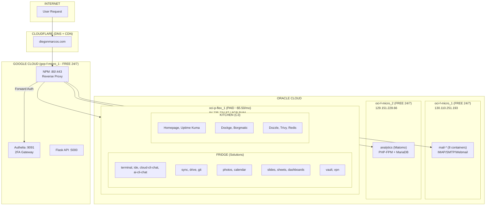

##### A1311) Auth Flow

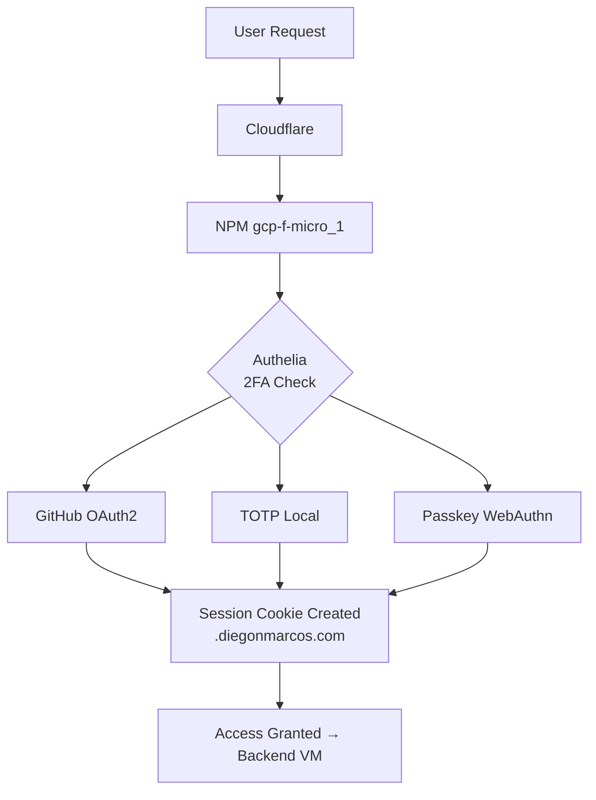

#### A132) Costs
```
┌─────────────────────────────────────────────────────────────────┐
│  MONTHLY COSTS                                                   │
├─────────────────────────────────────────────────────────────────┤
│  GCloud gcp-f-micro_1      │  FREE        │  24/7 gateway       │
│  Oracle oci-f-micro_1      │  FREE        │  24/7 mail          │
│  Oracle oci-f-micro_2      │  FREE        │  24/7 analytics     │
│  Oracle oci-p-flex_1       │  ~$5.50      │  wake-on-demand     │
│  Cloudflare                │  FREE        │  DNS + CDN          │
│  Domain                    │  ~$1         │  annual/12          │
├─────────────────────────────────────────────────────────────────┤
│  TOTAL CLOUD               │  ~$6.50/mo   │                     │
└─────────────────────────────────────────────────────────────────┘
```

### A14) Stack Consolidation

#### A140) DevOps Stack
```
Category             | Provider                 | Purpose
─────────────────────┼──────────────────────────┼────────────────────────────────
Code Repository      | GitHub                   | Version control, collaboration
Database Host        | Oracle Cloud             | SQLite / MariaDB / PostgreSQL
CI/CD Pipeline       | GitHub Actions           | Build, test, deploy automation
Web Hosting          | GitHub Pages             | Static site hosting (free)
Analytics            | Matomo (self-hosted)     | Privacy-focused web analytics
DNS + CDN            | Cloudflare               | DNS, SSL, caching, DDoS protection
```

#### A141) Security Stack
```
Component            | Stack                    | Purpose
─────────────────────┼──────────────────────────┼────────────────────────────────
Authelia             | Authelia + Redis         | 2FA Gateway, SSO, Session Mgmt
OAuth2 Providers     | OAuth2-Proxy             | Social Login Integration
  ↳ GitHub           | GitHub OAuth App         | Primary (dev-focused)
  ↳ Google           | Google OAuth             | Backup option
  ↳ Facebook         | Meta OAuth               | Future option
  ↳ X (Twitter)      | X OAuth                  | Future option
```

#### A142) WebDevs Stack
```
Project Type         | Stack                    | Output                  | Render
─────────────────────┼──────────────────────────┼─────────────────────────┼────────────

## Frontend (Browser)
Static Landing       | Vanilla HTML + CSS       | Single .html file       | None (static)
Service Fronts       | SvelteKit 5 + SCSS       | HTML + minimal JS       | SSR + Hydration
Cloud Dashboard      | SvelteKit 5 + SCSS       | HTML + JS chunks        | SSR + CSR
GitHub Pages         | SvelteKit 5 (static)     | Pre-rendered HTML       | Static export

## Templating (Python Backend)
Project              | Stack              | Data Input     | Template         | Output
─────────────────────┼────────────────────┼────────────────┼──────────────────┼──────────────────
Email Notifications  | Jinja2 + Python    | JSON/dict      | .html.j2         | .html (email)
PDF Reports          | Jinja2 + WeasyPrint| JSON/dict      | .html.j2         | .pdf
Markdown Docs        | Jinja2 + Markdown  | JSON/dict      | .md.j2           | .md → .html
Config Files         | Jinja2             | JSON/dict      | .yaml.j2/.toml.j2| .yaml/.toml
Spec Docs (ArchSpecs)| Jinja2             | .spec.json     | .md.j2           | .md
```


---

# B) Software and Technical Design (STD/TDD)


## B0) Software and Technical Design (STD/TDD)

### B00) Security Architecture

#### B000) Web Auth - Dual Authentication

**Plan:** `0.spec/Task_Security2faOAuth20/PLAN_DualAuth_Security.md`

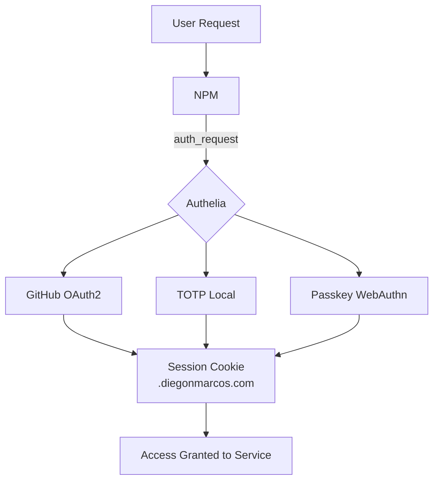

**Authentication Paths (Either grants access):**
- **Path 1:** GitHub OAuth2 - Passwordless, uses GitHub's 2FA
- **Path 2:** Local TOTP - Authelia internal user + TOTP app
- **Path 3:** Passkey/WebAuthn - Hardware key or biometric

**Key Components:**
- Authelia on GCP VM (central gateway)
- NPM forward auth for all services
- SSO via session cookie (domain: `.diegonmarcos.com`)

---

#### B001) Dev Access - SSH & Vault Management

**Secrets Storage Tiers:**

| Tier | Location | Purpose | Access Method |
|------|----------|---------|---------------|
| **LOCAL_KEYS** | `/home/diego/Documents/Git/LOCAL_KEYS/` | SSH keys, API tokens, infra creds | Terminal/CLI |
| **Bitwarden** | Cloud (bitwarden.com) | Browser passwords, TOTP seeds | Browser extension |
| **Vaultwarden** | vault.diegonmarcos.com | Full backup, privacy-sensitive | Self-hosted web |

**SSH Access Configuration:**

```bash
# LOCAL_KEYS structure
LOCAL_KEYS/
├── 00_terminal/
│   └── ssh/
│       ├── id_rsa              # Default key
│       ├── gcp_arch1           # GCloud VM
│       └── oci_*               # Oracle VMs
├── README.md                   # All credentials reference
└── ...

# Symlinked to ~/.ssh/
~/.ssh/ → LOCAL_KEYS/00_terminal/ssh/
```

**VM Access Commands:**

```bash
# GCP (NPM + Authelia)
gcloud compute ssh arch-1 --zone=us-central1-a

# Oracle VMs
ssh -i ~/.ssh/id_rsa ubuntu@130.110.251.193  # Mail
ssh -i ~/.ssh/id_rsa ubuntu@129.151.228.66   # Analytics
ssh -i ~/.ssh/id_rsa ubuntu@84.235.234.87    # Dev (p-flex)
```

**Vault Workflow:**
1. **Daily use:** Bitwarden Cloud (browser extension)
2. **Sensitive items:** Vaultwarden (self-hosted, Authelia protected)
3. **Infra credentials:** LOCAL_KEYS/README.md (terminal reference)

---

#### B002) Isolation - Network Segmentation & Hardening

**Defense Layers:**

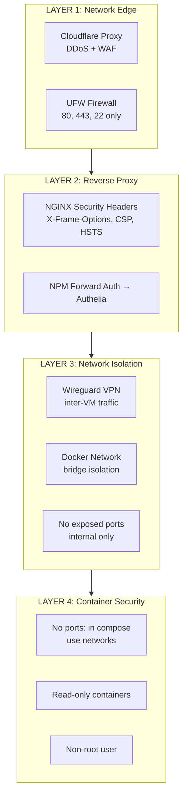

**UFW Rules (per VM):**

```bash
# Default deny
ufw default deny incoming
ufw default allow outgoing

# Allow SSH (restrict to known IPs if possible)
ufw allow 22/tcp

# Allow HTTP/HTTPS (only on proxy VM)
ufw allow 80/tcp
ufw allow 443/tcp

# Wireguard (inter-VM)
ufw allow 51820/udp
```

**Docker Compose Pattern (no exposed ports):**

```yaml
# SECURE: Internal network only
services:
  app:
    networks:
      - internal
    # NO "ports:" section - accessed via reverse proxy

networks:
  internal:
    driver: bridge
```

**NGINX Security Headers:**

```nginx
# Add to NPM Advanced config
add_header X-Frame-Options "SAMEORIGIN" always;
add_header X-Content-Type-Options "nosniff" always;
add_header X-XSS-Protection "1; mode=block" always;
add_header Referrer-Policy "strict-origin-when-cross-origin" always;
add_header Permissions-Policy "geolocation=(), microphone=(), camera=()" always;
```

---

### B01) Service Architecture

#### B010) Containers - Docker Compose Patterns

**Standard Service Pattern:**

```yaml
# Pattern: service-name/docker-compose.yml
version: "3.8"
services:
  app:
    image: ${SERVICE_IMAGE}
    container_name: ${SERVICE_NAME}-app
    restart: unless-stopped
    networks:
      - internal
      - proxy
    volumes:
      - ./data:/data
    environment:
      - TZ=Europe/Berlin
    labels:
      - "com.centurylinklabs.watchtower.enable=true"

networks:
  internal:
    driver: bridge
  proxy:
    external: true
    name: npm_network
```

**Multi-Container Service Pattern:**

```yaml
# Pattern: service with frontend + backend + database
services:
  front:
    build: ./frontend
    depends_on: [app]

  app:
    image: ${APP_IMAGE}
    depends_on: [db]
    environment:
      - DATABASE_URL=postgresql://db:5432/${DB_NAME}

  db:
    image: postgres:15-alpine
    volumes:
      - db_data:/var/lib/postgresql/data

volumes:
  db_data:
```

---

#### B011) Databases - Schemas & Migrations

**Database Distribution:**

| Service | Database | Location | Backup Strategy |
|---------|----------|----------|-----------------|
| mail-* | Maildir | oci-f-micro_1 | Syncthing → local |
| analytics | MariaDB | oci-f-micro_2 | Daily SQL dump |
| authelia | PostgreSQL | gcp-f-micro_1 | Persistent volume |
| git | SQLite | oci-p-flex_1 | File backup |
| photos | SQLite | oci-p-flex_1 | File backup |
| workflows | PostgreSQL | oci-p-flex_1 | Daily SQL dump |

**Migration Strategy:**
1. Schema changes via numbered migration files
2. Backup before migration
3. Test in dev environment first
4. Rollback plan documented

---

#### B012) APIs - Contracts & Versioning

**API Standards:**

| Aspect | Standard |
|--------|----------|
| Format | REST + JSON |
| Auth | Bearer token (from Authelia session) |
| Versioning | URL prefix `/api/v1/` |
| Docs | OpenAPI 3.0 spec |
| Errors | RFC 7807 Problem Details |

**Central API Gateway (api.diegonmarcos.com):**

```
/api/v1/
├── /services      # Service catalog
├── /metrics       # Monitoring data
├── /health        # Health checks
└── /auth          # Auth status
```

---

### B02) Infrastructure Architecture

#### B020) Networking - DNS, SSL, Reverse Proxy

**DNS Configuration (Cloudflare):**

| Record | Type | Target | Proxy |
|--------|------|--------|-------|
| @ | A | 34.55.55.234 | Yes |
| * | CNAME | @ | Yes |
| mail | A | 130.110.251.193 | No (direct) |

**SSL Strategy:**
- Cloudflare Origin certificates (15 years)
- NPM manages Let's Encrypt for non-proxied
- Force HTTPS everywhere

**Reverse Proxy Rules (NPM):**

```
*.diegonmarcos.com → NPM (34.55.55.234)
  ├── Forward Auth → Authelia (9091)
  └── Proxy to backend VM:port
```

---

#### B021) Storage - Volumes & Backups

**Volume Strategy:**

| Type     | Mount              | Backup           |
| -------- | ------------------ | ---------------- |
| Config   | `./config:/config` | Git repo         |
| Data     | `./data:/data`     | Syncthing        |
| Database | Named volume       | SQL dump         |
| Logs     | `/var/log`         | Rotate + archive |

**Backup Schedule:**

| Target    | Frequency | Retention | Method            |
| --------- | --------- | --------- | ----------------- |
| Configs   | On change | Forever   | Git push          |
| User data | Real-time | 30 days   | Syncthing         |
| Databases | Daily 3AM | 7 days    | pg_dump/mysqldump |
| Full VM   | Weekly    | 4 weeks   | Cloud snapshot    |

---

#### B022) Scaling - Wake-on-Demand & GPU

**Wake-on-Demand (oci-p-flex_1):**

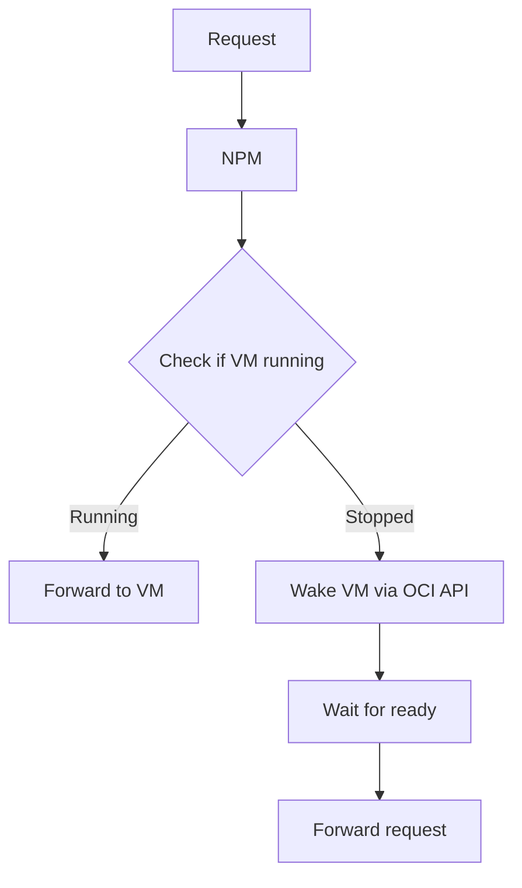

**GPU Provisioning (TensorDock/Vast.ai):**

```bash
# On-demand GPU workflow
1. Request GPU workload
2. Provision cheapest available GPU VM
3. Pull model/data from cloud storage
4. Execute workload
5. Push results to cloud storage
6. Terminate GPU VM
```

---

### B03) Collectors & Data

> **TODO:** Data pipelines, API gateway, collectors

---

### B04) MCP Architecture

> **Purpose:** Tools that give AI assistants (Claude Code, Claude Desktop, future AIs) access to your architecture, codebase, data, and infrastructure.
> **Location:** Runs locally on your machine, AI-agnostic infrastructure.

#### B030) System Overview


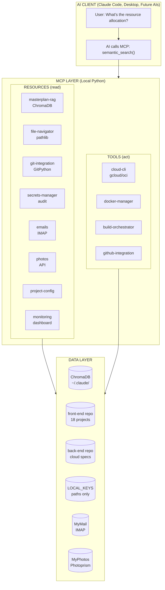


#### B031) RAG Pipeline (masterplan-rag)

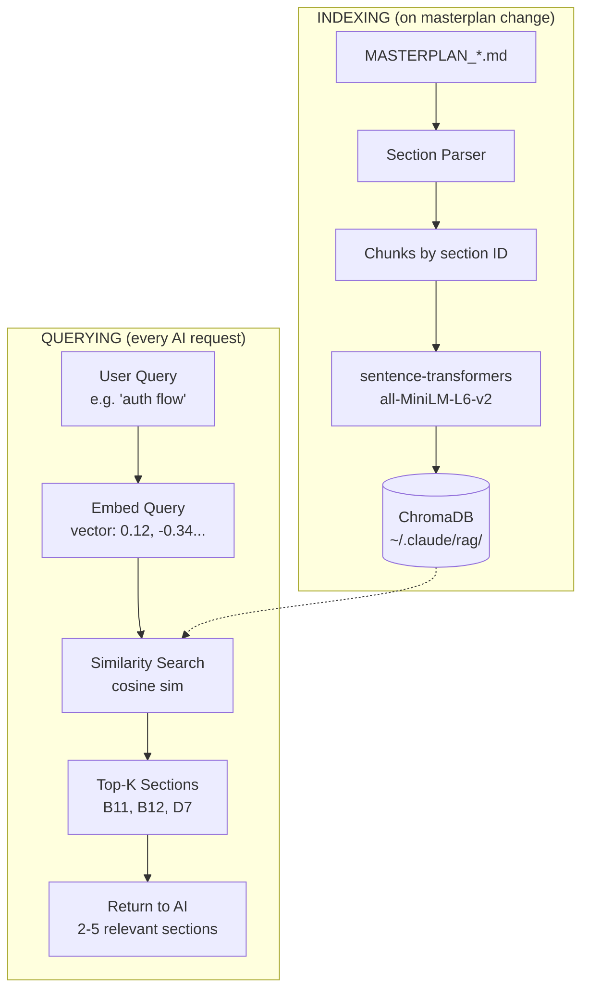

**Chunking Strategy:**
```
Chunk Type       | Granularity      | Example
─────────────────┼──────────────────┼─────────────────────────────────────
Section (H2)     | Major topic      | "## A2) Infra Resources"
Subsection (H3)  | Specific topic   | "### A201) VM Capacity & Headroom"
Table            | Data block       | Resource allocation tables
Code block       | Implementation   | Docker compose examples
```

#### B032) Security Model (secrets-manager)

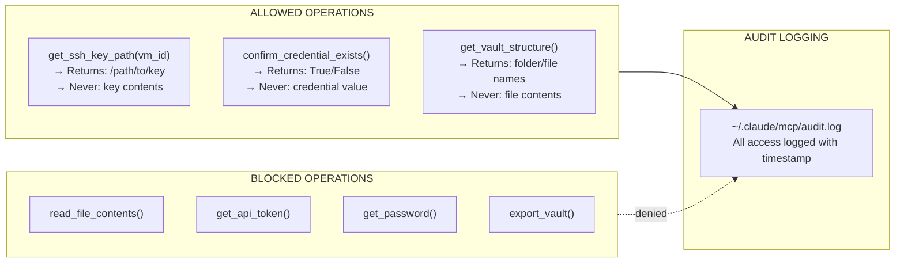

#### B033) Permission Model

```
┌─────────────────────────────────────────────────────────────────────────────┐
│                           MCP PERMISSION MODEL                                │
├─────────────────────────────────────────────────────────────────────────────┤
│                                                                             │
│  MCP                  │ READ │ WRITE │ EXECUTE │ DELETE │ Notes            │
│  ─────────────────────┼──────┼───────┼─────────┼────────┼──────────────────│
│  masterplan-rag       │  ✅  │  ❌   │   ❌    │   ❌   │ Query only       │
│  file-navigator       │  ✅  │  ❌   │   ❌    │   ❌   │ List/find only   │
│  git-integration      │  ✅  │  ❌   │   ❌    │   ❌   │ History only     │
│  secrets-manager      │  ⚠️  │  ❌   │   ❌    │   ❌   │ Paths only       │
│  project-config       │  ✅  │  ❌   │   ❌    │   ❌   │ Read package.json│
│  emails               │  ✅  │  ❌   │   ❌    │   ❌   │ Read only        │
│  photos               │  ✅  │  ❌   │   ❌    │   ❌   │ Metadata only    │
│  monitoring-dashboard │  ✅  │  ❌   │   ❌    │   ❌   │ Metrics only     │
│  cloud-cli            │  ✅  │  ❌   │   ⚠️    │   ❌   │ Status cmds only │
│  docker-manager       │  ✅  │  ❌   │   ⚠️    │   ❌   │ Restart allowed  │
│  build-orchestrator   │  ✅  │  ❌   │   ✅    │   ❌   │ Build scripts    │
│  github-integration   │  ✅  │  ❌   │   ⚠️    │   ❌   │ Trigger workflows│
│                                                                             │
│  Legend: ✅ Full  ⚠️ Limited  ❌ Blocked                                    │
│                                                                             │
└─────────────────────────────────────────────────────────────────────────────┘
```

#### B034) Directory Structure

```
~/.claude/
├── mcp/                              # MCP implementations
│   ├── masterplan_rag.py             # RAG with ChromaDB
│   ├── file_navigator.py             # File search
│   ├── git_integration.py            # Git queries
│   ├── secrets_manager.py            # Safe credential paths
│   ├── project_config.py             # Metadata queries
│   ├── emails.py                     # Mail archive search
│   ├── photos.py                     # Photo metadata search
│   ├── monitoring_dashboard.py       # Health/costs
│   ├── cloud_cli.py                  # gcloud/oci wrapper
│   ├── docker_manager.py             # Docker control
│   ├── build_orchestrator.py         # Build triggers
│   ├── github_integration.py         # GitHub API
│   ├── requirements.txt              # Python dependencies
│   └── audit.log                     # Access audit trail
│
├── rag/                              # RAG data
│   ├── masterplans.db                # ChromaDB vector store
│   └── chunks/                       # Cached chunks (debug)
│
└── mcp.json                          # MCP configuration
```

#### B035) Tool Specifications

#### RESOURCES (read)

**1. Masterplan RAG**
```
semantic_search(query: str) → List[Section]
  "What are the inference VM requirements?"
  → A20) Resource Estimation, A30) LLM Models

get_section(section_id: str) → Section
  get_section('B11') → Full B11) Web Auth section

list_sections(plan: str) → List[SectionMetadata]
  → All sections in MASTERPLAN_CLOUD.md
```

**2. File Navigator**
```
find_file(pattern: str, project: str = None) → List[FilePath]
  find_file('*.scss', 'linktree') → /linktree/src_static/scss/main.scss

list_project(project_name: str) → ProjectStructure
  → { framework: 'Vue 3', build_tool: 'Vite', port: 8003 }

tree_structure(max_depth: int = 2) → TreeView
```

**3. Git Integration**
```
get_commit_history(file: str, limit: int = 10) → List[Commit]
get_file_blame(file: str) → List[BlameLine]
search_commits(query: str) → List[Commit]
```

**4. Secrets Manager**
```
get_ssh_key_path(vm_id: str) → Path       # PATH ONLY, never key
confirm_credential_exists(service: str) → Boolean
get_vault_structure() → Dict              # Structure, not contents
```

**5. Project Config**
```
get_package_json(project_name: str) → PackageJSON
list_dependencies(project_name: str) → List[Dependency]
```

**6. Emails**
```
search_emails(query: str, limit: int = 10) → List[Email]
get_email(id: str) → Email
list_folders() → List[Folder]
```

**7. Photos**
```
search_photos(query: str, limit: int = 20) → List[PhotoMetadata]
get_photo_metadata(id: str) → PhotoMetadata
list_albums() → List[Album]
```

**8. Monitoring Dashboard**
```
get_uptime_status() → Dict[Service, Status]
get_cost_summary(period: str = 'month') → CostData
get_alerts() → List[Alert]
```

#### TOOLS (act)

**9. Cloud CLI**
```
get_vm_status(vm_id: str) → VMStatus
gcloud_exec(command: str, args: List[str]) → Output
oci_exec(command: str, args: List[str]) → Output
```

**10. Docker Manager**
```
list_services() → List[Service]
get_docker_logs(service_name: str, lines: int = 50) → String
restart_service(service_name: str) → Result
health_check(service_name: str) → Health
```

**11. Build Orchestrator**
```
build_project(project_name: str) → BuildResult
build_all() → Dict[ProjectName, BuildResult]
list_projects() → List[ProjectInfo]
```

**12. GitHub Integration**
```
get_workflow_status(workflow_name: str) → Status
list_open_issues() → List[Issue]
trigger_workflow(workflow_name: str) → Result
```

#### B036) Implementation Patterns

#### MCP Base Class (masterplan_rag.py)

```python
from sentence_transformers import SentenceTransformer
from pathlib import Path
import chromadb

class MasterplanRAG:
    def __init__(self, plans_dir):
        self.embedding_model = SentenceTransformer('all-MiniLM-L6-v2')
        self.client = chromadb.PersistentClient(path="~/.claude/rag")
        self.collection = self.client.get_or_create_collection("masterplans")

    def semantic_search(self, query: str, top_k: int = 5):
        query_embedding = self.embedding_model.encode(query).tolist()
        results = self.collection.query(
            query_embeddings=[query_embedding],
            n_results=top_k
        )
        return results
```

#### Secrets Manager (Security-Critical)

```python
class SecretsManager:
    ALLOWED_PATHS = {
        'oci-p-flex_1': '00_terminal/ssh/id_rsa',
        'gcp-f-micro_1': '00_terminal/ssh/gcp_arch1',
    }

    def get_ssh_key_path(self, vm_id: str) -> str:
        """Return path to SSH key (NEVER the key itself)"""
        if vm_id not in self.ALLOWED_PATHS:
            self._log_denied_access(vm_id)
            raise PermissionError(f"Not authorized: {vm_id}")

        key_path = self.vault / self.ALLOWED_PATHS[vm_id]
        self._log_access(vm_id, 'get_path')
        return str(key_path)  # PATH ONLY
```

#### MCP Configuration (~/.claude/mcp.json)

```json
{
  "mcpServers": {
    "masterplan_rag": {
      "command": "python3",
      "args": ["/home/diego/.claude/mcp/masterplan_rag.py"],
      "env": {
        "PLANS_DIR": "/home/diego/Documents/Git/back-System/cloud/0.spec"
      }
    },
    "file_navigator": {
      "command": "python3",
      "args": ["/home/diego/.claude/mcp/file_navigator.py"],
      "env": {
        "FRONT_REPO": "/home/diego/Documents/Git/front-Github_io",
        "BACK_REPO": "/home/diego/Documents/Git/back-System"
      }
    },
    "secrets_manager": {
      "command": "python3",
      "args": ["/home/diego/.claude/mcp/secrets_manager.py"],
      "env": {
        "VAULT_PATH": "/home/diego/Documents/Git/LOCAL_KEYS"
      }
    }
  }
}
```

#### B037) Dependencies & Testing

#### Python Dependencies

```
# ~/.claude/mcp/requirements.txt
sentence-transformers>=2.2.0
chromadb>=0.4.0
GitPython>=3.1.0
google-cloud-compute>=1.0.0
oci>=2.80.0
docker>=6.0.0
PyGithub>=2.0.0
```

#### Success Metrics

| Metric | Target |
|--------|--------|
| Context retention | No loss after 100K tokens |
| File navigation | < 5 sec (find any file) |
| Infrastructure access | 100% (no manual SSH) |
| Secret exposure | 0 (audit log confirms) |
| Build cycle time | < 2 min from AI |

---

# C) Roadmap - Planning & Prioritization

## C0) Phases - Implementation Milestones

### Phase 1: Security Foundation (PRIORITY)
**Status:** In Progress
**Dependencies:** None

| Step | Task | Status |
|------|------|--------|
| 1.1 | Deploy Authelia on GCP VM | Done |
| 1.2 | Configure GitHub OAuth App | Done |
| 1.3 | Setup NPM forward auth | Done |
| 1.4 | Test dual auth flow (GitHub + TOTP) | In Progress |
| 1.5 | Document credentials in LOCAL_KEYS | In Progress |

### Phase 2: Core Services
**Status:** Planned
**Dependencies:** Phase 1

| Step | Task | Status |
|------|------|--------|
| 2.1 | Mail (Mailu) deployment | Done |
| 2.2 | Sync (Syncthing) deployment | Done |
| 2.3 | Analytics (Matomo) deployment | Done |
| 2.4 | Vault (Vaultwarden) deployment | Planned |
| 2.5 | Photos (Photoprism) deployment | In Progress |

### Phase 3: DevOps Infrastructure
**Status:** Planned
**Dependencies:** Phase 1, Phase 2

| Step | Task | Status |
|------|------|--------|
| 3.1 | Monitoring collectors (Python) | Planned |
| 3.2 | Flask API endpoints | Planned |
| 3.3 | Cloud Portal (SvelteKit) | Planned |
| 3.4 | Architecture Specs system | Planned |

### Phase 4: Advanced Services
**Status:** Future
**Dependencies:** Phase 3

| Step | Task | Status |
|------|------|--------|
| 4.1 | Terminals (ttyd, code-server) | Future |
| 4.2 | Workflows (Temporal, LangGraph) | Future |
| 4.3 | AI Chat integration | Future |

---

## C1) Dependencies - Service Graph

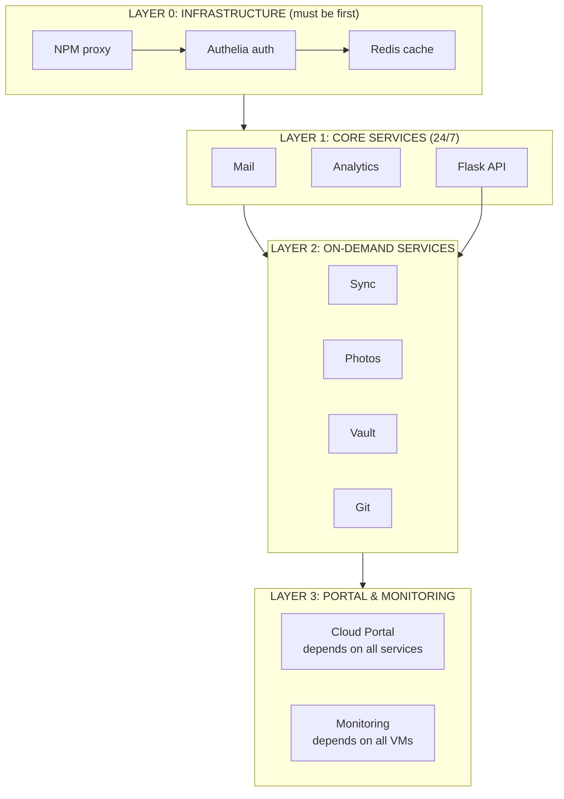

---

## C2) Backlog - Prioritized Tasks

### High Priority (Now)
- [ ] Complete Authelia TOTP setup
- [ ] Deploy Photoprism with proper auth
- [ ] Setup Vaultwarden
- [ ] Document all credentials in LOCAL_KEYS

### Medium Priority (Next)
- [ ] Build monitoring collectors
- [ ] Create Cloud Portal MVP
- [ ] Setup architecture specs system
- [ ] Configure email alerts

### Low Priority (Later)
- [ ] Terminal services (ttyd, code-server)
- [ ] Workflow engines (Temporal, LangGraph)
- [ ] AI Chat integration
- [ ] GPU on-demand provisioning

### Tech Debt
- [ ] Consolidate docker-compose files
- [ ] Standardize environment variables
- [ ] Create backup automation scripts
- [ ] Document disaster recovery procedures

---

# D) DevOps - Operations & Observability

## D0) Portal - Cloud Control Center (C3)

**Stack:** Homepage (gethomepage.dev) + Uptime Kuma

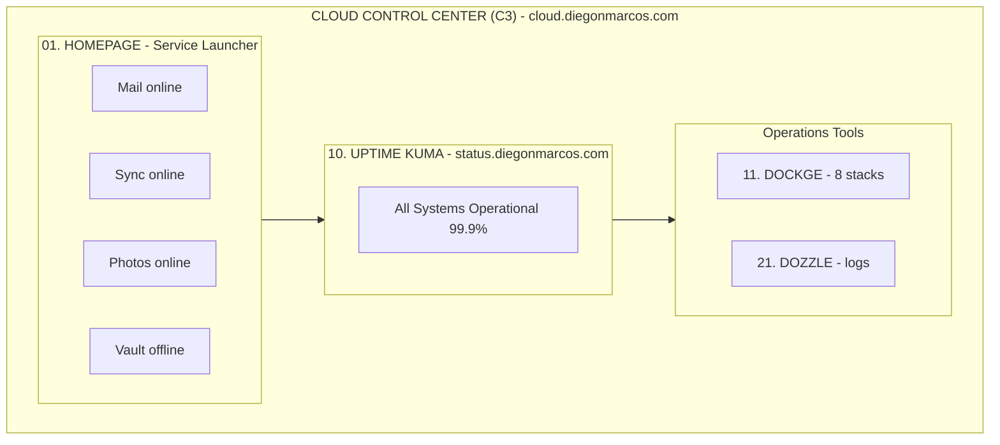

**C3 Components:**

| Code | Service | URL | Purpose |
|------|---------|-----|---------|
| 01 | Homepage | cloud.diegonmarcos.com | Service launcher + widgets |
| 10 | Uptime Kuma | status.diegonmarcos.com | Health checks + public status |
| 11 | Dockge | dockge.diegonmarcos.com | Docker Compose management |
| 20 | Borgmatic | (cron) | Automated backups |
| 21 | Dozzle | logs.diegonmarcos.com | Real-time container logs |
| 22 | Trivy | (cron) | Container vulnerability scans |

---

## D1) Monitoring - Uptime Kuma

**Tool:** Uptime Kuma (status.diegonmarcos.com)

### Monitoring Architecture

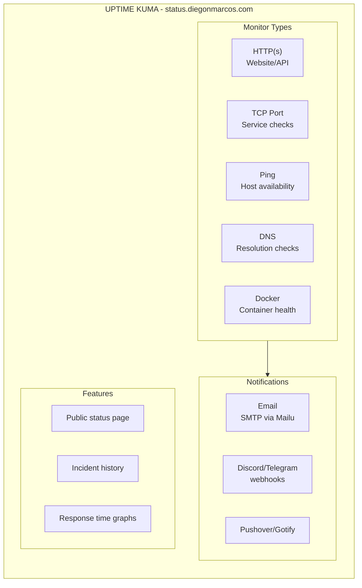

### Monitor Configuration

| Service | Type | Interval | Timeout |
|---------|------|----------|---------|
| NPM Proxy | HTTP | 60s | 10s |
| Authelia | HTTP | 60s | 10s |
| Mail (SMTP) | TCP:25 | 300s | 30s |
| Analytics | HTTP | 300s | 10s |
| Photos | HTTP | 300s | 10s |
| Sync | HTTP | 300s | 10s |

### Alert Thresholds

| Metric | Warning | Critical | Action |
|--------|---------|----------|--------|
| Response Time | >2s | >5s | Email alert |
| Consecutive Fails | 2 | 5 | Email + restart |
| Certificate Expiry | 14 days | 7 days | Email alert |

---

## D2) Knowledge Center

### Architecture Docs
**Plan:** `0.spec/Task_ArchSpecs/PLAN_ArchSpecs.md`

| Document | Purpose | Format |
|----------|---------|--------|
| MASTERPLAN.md | This document | Markdown |
| Service specs | Per-service details | JSON + MD |
| Network diagrams | Topology visualization | Mermaid |

### API Docs
| Endpoint | Documentation |
|----------|---------------|
| `/api/v1/*` | OpenAPI 3.0 spec |
| Service APIs | Per-service Swagger |

### Wiki / FAQ
| Topic | Content |
|-------|---------|
| Getting Started | How to access services |
| Troubleshooting | Common issues & fixes |
| Runbooks | Operational procedures |

---

## D3) Code Practices

> Reference: `MASTERPLAN_LINKTREE.md → D8) Code Practices` (full details)

### Backend (Python)

```
Category          | Standard
──────────────────┼────────────────────────────────────────────────────────
Language          | Python 3.11+ with type hints
Package Manager   | Poetry (NOT pip install globally)
Framework         | Flask for APIs, FastAPI for async
Templating        | Jinja2 for HTML/email/config generation
Data Processing   | Pandas for DataFrames, xsv for heavy CSV
Testing           | pytest + pytest-cov
Linting           | ruff (replaces flake8, isort, black)
```

### Infrastructure Code

```
Category          | Standard
──────────────────┼────────────────────────────────────────────────────────
IaC               | Docker Compose (no Kubernetes for personal infra)
Config Management | Jinja2 templates → YAML/TOML
Secrets           | Environment variables, never in code
Shell Scripts     | Bash with shellcheck, set -euo pipefail
```

### Docker Compose Standards

```yaml
# Standard pattern for all services
version: "3.8"
services:
  app:
    image: ${IMAGE}:${VERSION:-latest}
    container_name: ${SERVICE}-app
    restart: unless-stopped
    networks:
      - internal
    volumes:
      - ./data:/data:rw
      - ./config:/config:ro
    environment:
      - TZ=${TZ:-Europe/Berlin}
    healthcheck:
      test: ["CMD", "curl", "-f", "http://localhost:${PORT}/health"]
      interval: 30s
      timeout: 10s
      retries: 3
    labels:
      - "com.centurylinklabs.watchtower.enable=true"

networks:
  internal:
    driver: bridge
```

---

## D4) System Practices

### Package Management

**Rule:** NEVER install packages system-wide. Use isolated environments.

```
Tool              | Purpose                    | Command
──────────────────┼────────────────────────────┼────────────────────────────────
Poetry            | Python dependencies        | poetry add <package>
pipx              | Python CLI tools           | pipx install <tool>
nvm               | Node.js versions           | nvm use 18
npm (local)       | JS dependencies            | npm install (in project)
Docker            | Service isolation          | docker compose up
```

### Poetry Workflow

```bash
# Initialize new project
cd /path/to/project
poetry init

# Add dependencies
poetry add flask jinja2 requests
poetry add --group dev pytest ruff

# Run commands in virtual environment
poetry run python script.py
poetry run pytest

# Install from pyproject.toml
poetry install

# Export requirements.txt (for Docker)
poetry export -f requirements.txt -o requirements.txt
```

### Project Structure (Python Backend)

```
/<service>/
├── pyproject.toml           # Poetry config + dependencies
├── poetry.lock              # Locked versions
├── src/
│   └── <service>/
│       ├── __init__.py
│       ├── main.py          # Entry point
│       ├── api/             # API routes
│       ├── services/        # Business logic
│       ├── models/          # Data models
│       └── utils/           # Helpers
├── tests/
│   └── test_*.py
├── templates/               # Jinja2 templates
├── config/
│   └── settings.py          # Pydantic settings
├── Dockerfile
├── docker-compose.yml
└── .env.example
```

### Shell Script Standards

```bash
#!/usr/bin/env bash
set -euo pipefail  # Exit on error, undefined vars, pipe failures

# Constants at top
readonly SCRIPT_DIR="$(cd "$(dirname "${BASH_SOURCE[0]}")" && pwd)"
readonly LOG_FILE="/var/log/script.log"

# Functions before main logic
log() { echo "[$(date +'%Y-%m-%d %H:%M:%S')] $*" | tee -a "$LOG_FILE"; }
die() { log "ERROR: $*"; exit 1; }

# Main logic
main() {
    log "Starting..."
    # ...
    log "Done."
}

main "$@"
```

### Environment Variables

```bash
# .env.example (committed to git)
SERVICE_NAME=myservice
SERVICE_PORT=8080
DATABASE_URL=postgresql://localhost:5432/mydb
# SECRET_KEY=  # Never commit actual secrets

# .env (NOT committed, in .gitignore)
SECRET_KEY=actual-secret-here
```

### Git Practices

```
Pattern           | Rule
──────────────────┼────────────────────────────────────────────────────────
.gitignore        | Always include: .env, __pycache__, node_modules, dist/
Commits           | Conventional: feat:, fix:, docs:, chore:, refactor:
Branches          | main (production), dev (integration), feature/*
Secrets           | NEVER commit, use .env + .gitignore
Large files       | Use Git LFS or external storage
```

### Systemd Services (for non-Docker)

```ini
# /etc/systemd/system/myservice.service
[Unit]
Description=My Service
After=network.target

[Service]
Type=simple
User=diego
WorkingDirectory=/home/diego/services/myservice
ExecStart=/home/diego/.local/bin/poetry run python -m myservice
Restart=always
RestartSec=5
Environment=PYTHONUNBUFFERED=1

[Install]
WantedBy=multi-user.target
```

### Backup Strategy

```
Data Type         | Method                     | Frequency     | Retention
──────────────────┼────────────────────────────┼───────────────┼─────────────
Configs           | Git push                   | On change     | Forever
User data         | Syncthing                  | Real-time     | 30 days
Databases         | pg_dump / mysqldump        | Daily 3AM     | 7 days
VM snapshots      | Cloud provider             | Weekly        | 4 weeks
LOCAL_KEYS        | Manual to encrypted USB    | Monthly       | Forever
```

---

## File Structure

```
/home/diego/Documents/Git/back-System/cloud/
├── 0.spec/
│   ├── MASTERPLAN_CLOUD.md              # THIS FILE (Product-Engineer Handoff)
│   │
│   ├── Task_Security2faOAuth20/         # B1) Security Architecture
│   │   └── PLAN_DualAuth_Security.md
│   │
│   └── Task_ArchSpecs/                  # B2) Service Architecture
│       └── PLAN_ArchSpecs.md
│
├── 1.ops/
│   ├── cloud_dash.json                  # Services data (source of truth)
│   ├── cloud_dash.py                    # Flask API server
│   └── vm-control.sh                    # VM start/stop script
│
├── 2.app/                               # C3 Docker Compose stacks
│   ├── c3-homepage/                     # 01 Homepage dashboard
│   │   ├── docker-compose.yml
│   │   └── config/
│   │       ├── services.yaml
│   │       └── bookmarks.yaml
│   ├── c3-uptime-kuma/                  # 10 Uptime Kuma
│   │   └── docker-compose.yml
│   ├── c3-dockge/                       # 11 Dockge
│   │   └── docker-compose.yml
│   ├── c3-borgmatic/                    # 20 Borgmatic
│   │   ├── docker-compose.yml
│   │   └── borgmatic.yaml
│   ├── c3-dozzle/                       # 21 Dozzle
│   │   └── docker-compose.yml
│   └── c3-trivy/                        # 22 Trivy
│       └── trivy-scan.sh
│
├── vps_oracle/
│   ├── vm-oci-f-micro_1/               # Mail VM
│   ├── vm-oci-f-micro_2/               # Analytics VM
│   └── vm-oci-p-flex_1/                # Dev services VM (hosts C3)
│
└── vps_gcloud/
    └── vm-gcp-f-micro_1/               # Proxy + Auth VM
```

---

## Document Map

| Section | Purpose | Owner |
|---------|---------|-------|
| **A) HANDOFF** | Complete service & stack definition | Product + Engineer |
| A0-A1 | Stack choices + Service catalog | Product defines |
| A2-A3 | Resources + Infrastructure | Engineer validates |
| A4-A5 | Tech research + Current state | Both collaborate |
| **B) ARCHITECTURE** | Technical deep dives | Engineer owns |
| B1 | Security patterns | Engineer |
| B2 | Service patterns | Engineer |
| B3 | Infrastructure patterns | Engineer |
| **C) ROADMAP** | Planning & prioritization | Product + Engineer |
| C1-C3 | Phases, dependencies, backlog | Both collaborate |
| **D) DEVOPS** | Operations & observability | Engineer owns |
| D1-D3 | Portal, monitoring, docs | Engineer |

---

## Quick Reference

### Service URLs

| Service | URL | Auth |
|---------|-----|------|
| NPM Admin | http://34.55.55.234:81 | Local |
| Authelia | https://auth.diegonmarcos.com | - |
| Mail | https://mail.diegonmarcos.com | Authelia |
| Analytics | https://analytics.diegonmarcos.com | Authelia |
| Gitea | https://git.diegonmarcos.com | Authelia |
| Sync | https://sync.diegonmarcos.com | Authelia |
| Vault | https://vault.diegonmarcos.com | Authelia |
| Photos | https://photos.diegonmarcos.com | Authelia |
| Cloud | https://cloud.diegonmarcos.com | Authelia |


---


# X) APPENDIX - Reference Material

## X0) Code Practices

> **Source:** `/front-Github_io/1.ops/30_Code_Practise.md`

### X00) Tech Stack & Environment

- **Framework:** SvelteKit (Svelte 5 Runes Mode) / Vue 3 (Composition API)
- **Language:** TypeScript (Strict Mode)
- **Styling:** SCSS (Sass) with "Golden Mixins"
- **Analytics:** Matomo (Self-Hosted) via custom component
- **Rendering:** Hybrid (SSR + SPA Client-Side Navigation)

### X01) Svelte 5 & TypeScript Rules

**CRITICAL:** Do NOT use Svelte 4 syntax.

```
Props     → let { propName }: { propName: Type } = $props();   // NEVER use export let
State     → let count = $state(0);                              // NEVER use let var = val
Computed  → let doubled = $derived(count * 2);                  // NEVER use $: var = val
Effects   → $effect(() => { ... });                             // NEVER use onMount for reactive
Events    → onclick, oninput                                    // NEVER use on:click
```

**Typing:**
- Always import `PageData` and `PageServerLoad` from `./$types`
- Use `HTMLInputElement`, `HTMLButtonElement`, etc., for DOM refs

### X02) Vue 3 Rules

**Always use Composition API with `<script setup lang="ts">`**

```typescript
// Props - use generic type syntax
defineProps<{ id: number; name: string }>()

// Refs - explicit types for nullable
const user = ref<User | null>(null)

// Emits - typed
defineEmits<{ (e: 'update', id: number): void }>()
```

### X03) HTML & Accessibility

**Goal:** Semantic, accessible, and clean HTML.

- **No Div Soup:**
  - ❌ `div class="nav"` → ✅ `<nav>`
  - ❌ `div class="card"` → ✅ `<article class="card">`
  - ❌ `div class="footer"` → ✅ `<footer>`
- **Buttons vs Links:**
  - Use `<a href="...">` ONLY for navigation (changing URLs)
  - Use `<button type="button">` for actions (toggles, modals, API calls)
- **Forms:** Every `<input>` must have a linked `<label>` (via `for` attribute or wrapping)
- **Images:** All `` tags MUST have an `alt` attribute

### X04) SCSS & Styling Rules (Golden Mixins)

**Goal:** Consistent, mobile-first responsive design.

**Global Logic:**
- Use **Flexbox** or **Grid** for all layouts
- **FORBIDDEN:** `float`, `clear`, or `position: absolute` (unless for UI overlays)
- Use `rem` for spacing/fonts, `%` for widths

**The Golden Mixins:**
```scss
// Breakpoints (Mobile-first)
$breakpoints: ('sm': 480px, 'md': 768px, 'lg': 1024px, 'xl': 1280px);
@mixin mq($size) {
  @media (min-width: map-get($breakpoints, $size)) { @content; }
}

// Flexbox
@mixin flex-center { display: flex; justify-content: center; align-items: center; }
@mixin flex-row($justify: flex-start, $align: stretch, $gap: 0) {
  display: flex; flex-direction: row; justify-content: $justify;
  align-items: $align; gap: $gap; flex-wrap: wrap;
}
@mixin flex-col($justify: flex-start, $align: stretch, $gap: 0) {
  display: flex; flex-direction: column; justify-content: $justify;
  align-items: $align; gap: $gap;
}

// CSS Grid
@mixin grid-auto-fit($min-size: 250px, $gap: 1rem) {
  display: grid; grid-template-columns: repeat(auto-fit, minmax($min-size, 1fr)); gap: $gap;
}
```

### X05) TypeScript Rules (Vanilla)

**Strict Null Checks for DOM:**
```typescript
// ❌ Bad - Object is possibly null
document.querySelector('.btn').addEventListener(...)

// ✅ Good - Check null, cast type
const btn = document.querySelector('.btn') as HTMLButtonElement;
if (btn) { btn.addEventListener('click', handler); }
```

**Rules:**
- **Strict Mode:** No `any`, handle `null`/`undefined`
- **Explicit Casting:** Cast to specific type (`HTMLInputElement` not `HTMLElement`)
- **ES Modules:** Use `import`/`export`, no global variables

### X06) Analytics (Matomo SPA Tracking)

**Problem:** In SPA, page doesn't reload - analytics won't track navigation.

**Solution:** Hook into router's navigation event.

```svelte
<script lang="ts">
  import { onMount } from 'svelte';
  import { page } from '$app/stores';
  import { afterNavigate } from '$app/navigation';
  import { browser } from '$app/environment';

  function track(action: any[]) {
    if (browser && window._paq) { window._paq.push(action); }
  }

  // Initial load
  onMount(() => {
    window._paq = window._paq || [];
    track(['trackPageView']);
  });

  // SPA navigation
  afterNavigate((navigation) => {
    if (navigation.type === 'enter') return;
    track(['setCustomUrl', $page.url.href]);
    track(['setDocumentTitle', document.title]);
    track(['trackPageView']);
  });
</script>
```

---

## X1) System OS Practices

> System-level package management, app installation, and environment standards.

### X10) Package Management

**MANDATORY:** Use the right tool for each package type.

```
Package Type        | Tool      | Why                                    | Example
────────────────────┼───────────┼────────────────────────────────────────┼─────────────────────────
Python Packages     | Poetry    | Dependency isolation, lock files       | poetry add requests
Python CLI Tools    | pipx      | Isolated environments for CLI apps     | pipx install black
Node.js Packages    | npm/pnpm  | Per-project node_modules               | npm install
Node.js Version     | nvm       | Multiple Node versions                 | nvm use 20
GUI Applications    | Flatpak   | Sandboxed, distro-agnostic             | flatpak install flathub org.gimp.GIMP
CLI Tools           | Nix       | Reproducible, declarative              | nix-env -iA nixpkgs.ripgrep
System Packages     | pacman    | Arch Linux system packages             | pacman -S base-devel
```

### X11) Python Environment

**Poetry is MANDATORY for all Python projects.**

```bash
# Project setup
poetry new myproject          # New project
poetry init                   # Existing project
poetry add requests           # Add dependency
poetry add --dev pytest       # Add dev dependency
poetry install                # Install from lock file
poetry shell                  # Activate venv
poetry run python script.py   # Run in venv

# Global CLI tools (NOT Poetry)
pipx install black            # Code formatter
pipx install ruff             # Linter
pipx install pre-commit       # Git hooks
```

**pyproject.toml structure:**
```toml
[tool.poetry]
name = "myproject"
version = "0.1.0"
python = "^3.11"

[tool.poetry.dependencies]
python = "^3.11"
requests = "^2.31"

[tool.poetry.group.dev.dependencies]
pytest = "^7.4"
ruff = "^0.1"
```

### X12) Node.js Environment

**nvm is MANDATORY for Node.js version management.**

```bash
# Version management
nvm install 20                # Install Node 20
nvm use 20                    # Use Node 20
nvm alias default 20          # Set default

# Per-project version (.nvmrc)
echo "20" > .nvmrc
nvm use                       # Reads .nvmrc

# Package managers
npm install                   # Install deps
npm ci                        # Clean install (CI)
pnpm install                  # Faster alternative
```

### X13) Application Installation

**Flatpak for GUI apps, Nix for CLI tools.**

```bash
# GUI Apps → Flatpak (sandboxed, auto-updates)
flatpak install flathub org.gimp.GIMP
flatpak install flathub com.obsidian.Obsidian
flatpak install flathub com.discordapp.Discord
flatpak install flathub org.mozilla.firefox

# CLI Tools → Nix (reproducible, declarative)
nix-env -iA nixpkgs.ripgrep
nix-env -iA nixpkgs.fd
nix-env -iA nixpkgs.bat
nix-env -iA nixpkgs.eza

# Or use home-manager for declarative config
# ~/.config/home-manager/home.nix
```

### X14) Dotfiles & Configuration

**Centralized dotfiles with symlinks.**

```bash
# Structure
~/Documents/Git/dotfiles/
├── .bashrc
├── .zshrc
├── .gitconfig
├── .config/
│   ├── nvim/
│   ├── alacritty/
│   └── starship.toml
└── install.sh              # Symlink script

# Symlink pattern
ln -sf ~/Documents/Git/dotfiles/.bashrc ~/.bashrc
ln -sf ~/Documents/Git/dotfiles/.config/nvim ~/.config/nvim
```

### X15) Docker Practices

```bash
# Development
docker compose up -d          # Start services
docker compose logs -f        # Follow logs
docker compose down           # Stop services

# Cleanup
docker system prune -a        # Remove unused
docker volume prune           # Remove volumes

# Never run as root inside containers
# Always use non-root user in Dockerfile
```

### X16) Backup & Sync

```bash
# Syncthing for real-time sync
# Restic for backups

# Critical paths to backup:
# - ~/Documents/Git/LOCAL_KEYS/
# - ~/Documents/Git/dotfiles/
# - ~/.ssh/ (symlinked from LOCAL_KEYS)
# - ~/.gnupg/
```

---

## X2) Tech Research

### X20) Framework Comparison (Frontend)
```
Criteria        | Vanilla (HTML+CSS+JS)    | Vue3 + Nuxt3 (SSR)       | SvelteKit 5 (SSR)
────────────────┼──────────────────────────┼──────────────────────────┼──────────────────────────
SEO             | ★★★★★ Excellent          | ★★★★★ Excellent (SSR)    | ★★★★★ Excellent (SSR)
Performance     | ★★★★★ Best (no overhead) | ★★★★☆ Good (Vue runtime) | ★★★★★ Excellent (compiles)
Complexity      | ★☆☆☆☆ Hard at scale      | ★★★☆☆ Medium             | ★★★★☆ Low-Medium
Consistency     | ★☆☆☆☆ No patterns        | ★★★★☆ Good (SFC)         | ★★★★★ Opinionated
Bundle Size     | 0 KB (no framework)      | ~50 KB (Vue runtime)     | ~5 KB (compiles away)
Learning Curve  | Low (basics)             | Medium-High              | Low-Medium
SSR Support     | Manual only              | Built-in (Nuxt3)         | Built-in
Static Export   | Native                   | Built-in (Nuxt3)         | Built-in
```

### X21) Framework Comparison (Templating - Python/JS Backend)
```
Criteria        | Jinja2 (Python)          | Mako (Python)            | Handlebars (JS)
────────────────┼──────────────────────────┼──────────────────────────┼──────────────────────────
Performance     | ★★★★☆ Fast               | ★★★★★ Fastest            | ★★★★☆ Fast
Syntax          | ★★★★★ Clean {{ }}        | ★★★☆☆ ${} + Python       | ★★★★☆ Clean {{ }}
Logic Support   | ★★★★★ Full (loops, if)   | ★★★★★ Full + Python      | ★★☆☆☆ Logic-less
Learning Curve  | ★★★★★ Easy               | ★★★☆☆ Medium             | ★★★★★ Easy
Ecosystem       | ★★★★★ Flask, Ansible     | ★★★☆☆ SQLAlchemy         | ★★★★☆ Node.js, Mustache
Inheritance     | ★★★★★ Extends + Blocks   | ★★★★★ Extends + Blocks   | ★★★☆☆ Partials only
Debug           | ★★★★★ Clear errors       | ★★★☆☆ Verbose            | ★★★★☆ Good
```

### X22) When to Use
```
Use Case             | Best Choice              | Why
─────────────────────┼──────────────────────────┼────────────────────────────────────────

## Static / SEO Pages (minimal JS, SEO-first, some dynamic)
 - Landing pages        | Vanilla or SvelteKit     | SEO matters, minimal JS needed
 - Login/Auth pages     | Vanilla                  | Simple forms, no framework needed
 - Dashboards           | SvelteKit                | Reactive data, SSR for initial load

## Documentation (Markdown → HTML, Obsidian-like workflow)
 - Docs / Knowledge Base| SvelteKit (static)       | Markdown support, fast builds
 - API Docs             | SvelteKit + OpenAPI      | Auto-generated from specs

## Web Apps (interactive, component-based)
 - Data Apps            | SvelteKit or Nuxt3       | Forms, lists, CRUD operations
 - Media Apps           | SvelteKit or Nuxt3       | Maps, music, photos, video players
 - Games                | Vanilla + Phaser/Three.js| Direct Canvas/WebGL, no overhead

## MVPs / Prototypes (fast iteration, throwaway code)
 - Quick prototypes     | Vue3 + Vite              | Fast HMR, familiar syntax
 - Hackathons           | Vue3 + Vite              | Speed over architecture

## Server-Side Templating (Python backend, no JS)
 - Email templates      | Jinja2                   | Dynamic emails from Python
 - PDF/HTML reports     | Jinja2                   | Generate from data + template
 - Config generation    | Jinja2                   | YAML/JSON/TOML from templates
 - Batch HTML pages     | Jinja2                   | Bulk generate static pages
 - Flask views          | Jinja2                   | Server-rendered HTML (no SPA)
```

---

## X3) Current State

### X30) by Service
``` java
Service           | Public URL                      | VM             | Container       | IP:Port             | Status
──────────────────┼─────────────────────────────────┼────────────────┼─────────────────┼─────────────────────┼────────

## FRIDGE

Terminals
↳ WebTerminal     | terminal.diegonmarcos.com       | oci-p-flex_1   | terminal-app    | 84.235.234.87:7681  | dev

User Productivity
↳ Mail            | mail.diegonmarcos.com           | oci-f-micro_1  | mailu-front     | 130.110.251.193:443 | on
↳ Sync            | sync.diegonmarcos.com           | oci-p-flex_1   | sync-app        | 84.235.234.87:8384  | on
↳ Git             | git.diegonmarcos.com            | oci-p-flex_1   | git-app         | 84.235.234.87:3000  | dev
↳ Photos          | photos.diegonmarcos.com         | oci-p-flex_1   | photoprism-app  | 84.235.234.87:2342  | on
↳ Calendar        | cal.diegonmarcos.com            | oci-p-flex_1   | radicale-app    | 84.235.234.87:5232  | on

User Security
↳ Vault           | vault.diegonmarcos.com          | oci-p-flex_1   | vault-app       | 84.235.234.87:80    | dev
↳ VPN (OpenVPN)   | (UDP direct)                    | oci-p-flex_1   | vpn-app         | 84.235.234.87:1194  | dev

## KITCHEN

Cloud Control Center (C3)
↳ Analytics       | analytics.diegonmarcos.com      | oci-f-micro_2  | matomo-app      | 129.151.228.66:8080 | on
↳ Cloud Dashboard | cloud.diegonmarcos.com          | squarespace    | (external)      | 198.49.23.144       | on
↳ Flask API       | (internal)                      | gcp-f-micro_1  | flask-app       | 34.55.55.234:5000   | on

Devs Security
↳ Proxy Admin     | proxy.diegonmarcos.com          | gcp-f-micro_1  | npm-gcloud      | 34.55.55.234:81     | on
↳ Auth (Authelia) | auth.diegonmarcos.com           | gcp-f-micro_1  | authelia-app    | 34.55.55.234:9091   | on
↳ Authelia Redis  | (internal)                      | gcp-f-micro_1  | authelia-redis  | 34.55.55.234:6379   | on

Devs Infrastructure
↳ Cache           | (internal)                      | oci-p-flex_1   | cache-app       | 84.235.234.87:6379  | on
```

### X31) by VM
``` html
Host   | VM             | RAM   | VRAM | Storage | IP              | Services Running                          | Notes
───────┼────────────────┼───────┼──────┼─────────┼─────────────────┼───────────────────────────────────────────┼─────────────────
GCloud | gcp-f-micro_1  | 1 GB  | -    | 30 GB   | 34.55.55.234    | npm, authelia, redis, flask-app           | 24/7 FREE
Oracle | oci-f-micro_1  | 1 GB  | -    | 47 GB   | 130.110.251.193 | mailu-* (8 containers)                    | 24/7 FREE
Oracle | oci-f-micro_2  | 1 GB  | -    | 47 GB   | 129.151.228.66  | matomo-app, matomo-db                     | 24/7 FREE
Oracle | oci-p-flex_1   | 8 GB  | -    | 100 GB  | 84.235.234.87   | sync, photos, git, cal, cache...          | WAKE $5.5/mo
```

---

*Generated by Claude (Opus) - CTO*
*Last Updated: 2025-12-11*
